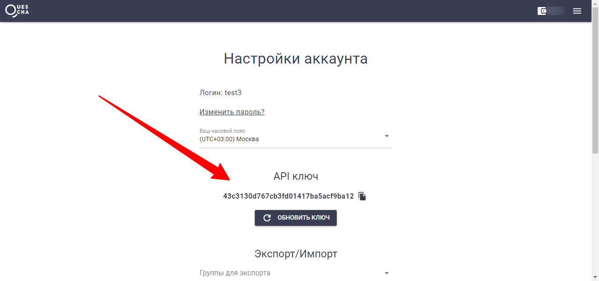

# API

Для запросов к API конструктора вам потребуется API ключ, который находится в настройках аккаунта.

<figure><figcaption></figcaption></figure>

Все запросы должны выполняться методом POST или GET. В заголовках запроса необходимо передавать API ключ в параметре Authorization

```
// Пример передачи параметра авторизации в заголовке запроса
Authorization: 43c3130d767cb3fd01417ba5acf9ba12
```

Или передать параметр key с API ключом

```
// Пример передачи параметра авторизации методом GET
...?key=43c3130d767cb3fd01417ba5acf9ba12...
```

Базовый адрес для запросов к API **https://api.quescha.com/api**


```
Полный URL запроса к API конструктора: Базовый адрес + метод
```


Все методы API перечислены [далее](webapp-katalog.md).
