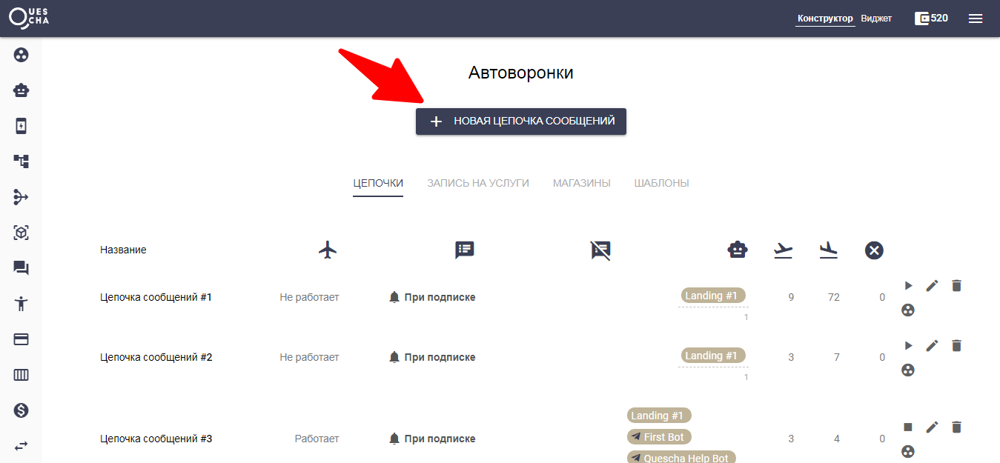
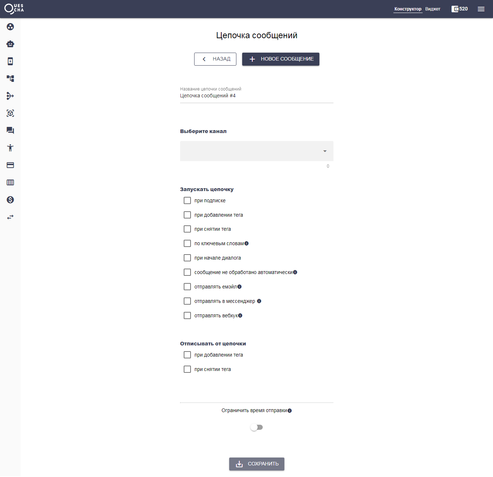

# Цепочки

Цепочки сообщений формируют автоворонку.

Перед тем, как приступить к теме, обозначим общую схему действий по созданию автоворонки.

* Создаем каналы (боты в мессенджерах или бот-лендинг)
* Создаем цепочки сообщений
* Привязываем каналы к цепочкам
* Привлекаем подписчиков на бота или бот-лендинг

Каждая цепочка запускается или останавливается по триггеру. Триггером может быть первоначальная подписка на бота, первое сообщение, ключевые слова или добавление/удаление тегов


Тегами являются текстовые метки, которые добавляются или удаляются у цепочки сообщений



Одновременно могут работать сразу несколько  цепочек сообщений. Однако следует знать, что сообщения всех цепочек выстраиваются в очередь в порядке времени отправки сообщений. Второй момент это то, что режим сценария приостанавливает всю очередь всех цепочек до тех пор, пока сценарий не будет завершен.&#x20;


Чтобы создать новую цепочку сообщений, на странице Автоворонки нажмите “Новая цепочка сообщений”

Создана пустая цепочка, которую необходимо настроить.

#### Название цепочки сообщений

Цепочек может быть очень много, поэтому названия следует писать такие, чтобы вы поняли тему или функцию, которую выполняет цепочка.

#### Выберите канал

Выберите ботов или бот-лендинг, которые будут работать с этой цепочкой сообщений.

#### Запускать цепочку

Настройте триггеры, при которых цепочка будет запущена. Если это стартовая цепочка, то следует поставить галочку “при подписке”.


Также есть возможность подключить емэйл, вебхук и мессенджер при запуске цепочки, которая будет содержать информацию о подписчике.


#### Отписывать от цепочки

Цепочка может быть остановлена как при добавлении тега, так и при удалении. Например, при добавлении какого-либо тега одна цепочка запускается, а другая останавливается.

#### Ограничить время отправки

Если вы хотите, чтобы клиент получал сообщения только в определенные дни недели и определенный интервал времени, задайте это здесь.


Вы сможете выставить свой часовой пояс в настройках аккаунта в правом меню


После настройки цепочки, сохраните ее и можете приступать к созданию сообщений.


С мая 2023 года в WhatsApp перестали работать кнопки. Учтите это при создании сценария бота для этого мессенджера.

