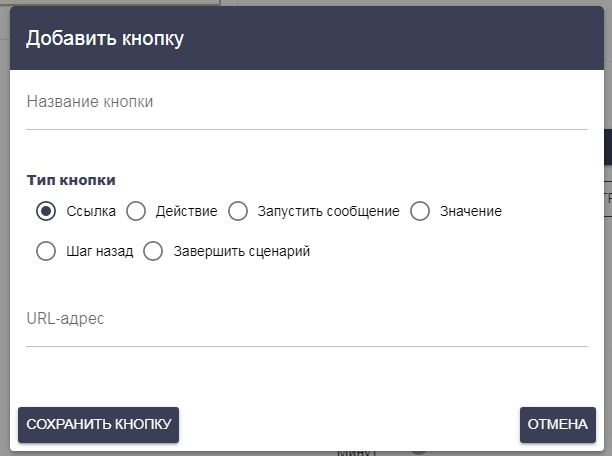

# Кнопки

#### Кнопка для сообщения без сценария

Для сообщения без сценария можно добавить следующие типы кнопок:

* Ссылка
* Запуск тегов
* Отписаться

Введите название кнопки и выберите ее тип.

_Ссылка_

При нажатии на такую кнопку будет выполнен переход в браузер по указанной ссылке.

_Запуск тегов_

Если вы выбрали тип кнопки “Запуск тегов”, то сможете указать теги для добавления и удаления, которые запустят или остановят цепочки сообщений с этими тегами

Кроме этого, если вы укажите строку данных, она будет передана в запускаемые цепочки.

Данные следует разделять символом “|”. Также передавать можно ответы и данные текущего сценария, используя шаблоны \[Answer..], \[Data..] (а также их альтернативные написания), где .. означает цифру ответа или данных.

В новой цепочке, полученные данные станут доступны при помощи шаблона \[Data..] и его аналогов.

_Отписаться_

При выборе типа Отписаться, подписчик перестанет получать какие-либо сообщения, пока заново этого не затребует.

#### Дополнительные типы кнопок для сообщения со сценарием

Помимо перечисленных выше типов ссылки и действия, к сценарной кнопке добавлены несколько типов:

* Запустить сообщение
* Значение
* Шаг назад
* Завершить сценарий

_Запустить сообщение_

При нажатии на кнопку типа “Запустить сообщение”, будет запущено указанное сообщение. Никакие проверки, при этом, не выполняются.

_Значение_

При нажатии на кнопку типа “Значение”, в ответ блока будет передано указанное значение. Такое значение может расценивается как текст отправленный самим подписчиком и может быть использовано при проверке условий. Значение будет доступно в шаблонах ответов \[Answer], \[AnswerX], \[AnswerID(blockid)]

_Шаг назад_

При нажатии на кнопку “Шаг назад”, подписчик сможет вернуться на один шаг назад, если он ошибся со вводом ответа и т.д.

_Завершить сценарий_

При нажатии кнопки типа “Завершить сценарий”, сценарий будет завершен. Если вы указали сообщение для выхода из сценария, подписчик получит его.

### Генерация кнопок

Вы можете генерировать кнопки, делая выборку из списка и указывая переменные в настройке кнопки в полях названий и ссылок/запуска сообщений/значений.


С мая 2023 года в WhatsApp перестали работать кнопки. Учтите это при создании сценария бота для этого мессенджера.

