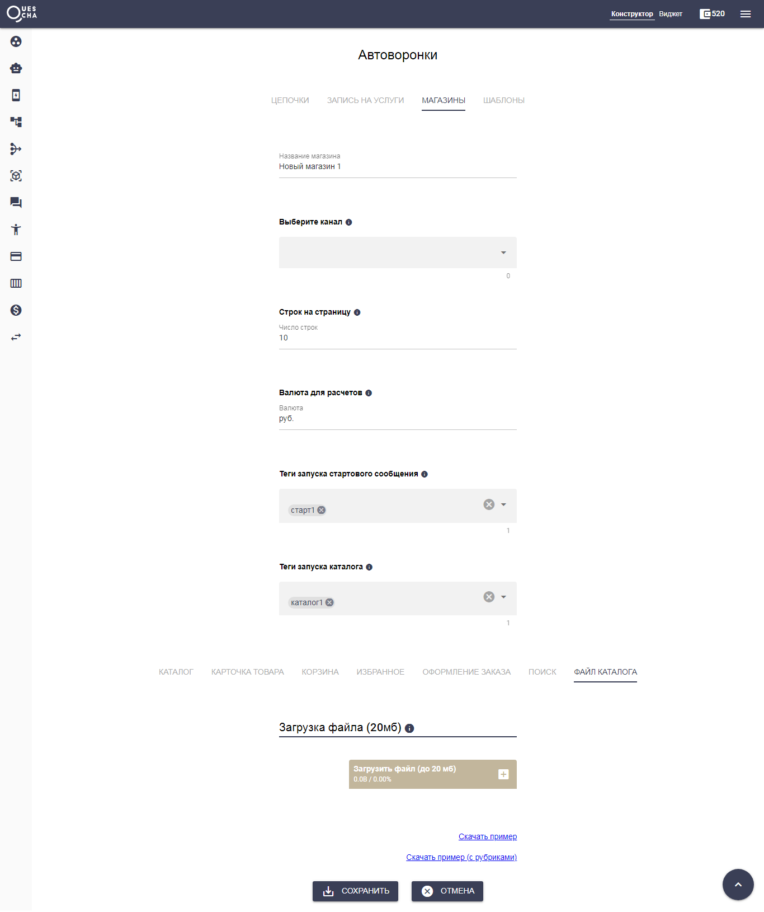

# Модуль магазина

Магазин, который находится на странице Автоворонки - это готовый сценарий чат-бота магазина, который позволяет загружать каталог товаров, подгружать картинки к карточкам товаров, содержит Платежи, Карточку товара, Корзину, Избранное, Поиск, Систему скидок, Промокодов.&#x20;

Вам остается только настроить магазин под свою специфику и запустить полноценный магазин в мессенджере или бот-лендинге.

Магазин работает через импорт файла Excel с каталогом товаров, что позволяет быстро и удобно создать магазин на сотни и тысячи товаров в мессенджере и бот-лендинге.

Поддерживает:

* рубрики
* поиск по товарам
* корзину
* избранное
* изображение карточек
* промокоды
* добавление к сумме заказа при выборе способа доставки
* учет остатков

Для того, чтобы создать магазин, на странице Автоворонки, переходим на вкладку “Магазины” и нажимаем “Добавить магазин”.

Вводим название магазина.

Далее выбираем каналы, в которых магазин будет работать.

Настраиваем теги для стартового сообщения и запуска каталога.

Стартовое сообщение (а вернее цепочка) будет создано при создании магазина. Вы сможете его отредактировать под себя.

Из стартового сообщения по кнопке запускается каталог.

Разберем все вкладки настроек магазина по-очереди.

#### Каталог

На этой вкладке настраиваются уровни вложенности рубрик. Сами рубрики перечисляются в файле импорта.


Важно, чтобы количество заданных уровней, совпадало с количеством уровней в файле импорта


Измените другие настройки, касающиеся каталога, если вам это необходимо.

#### Карточка товара

На этой вкладке настраивается карточка товара. Используйте шаблоны подстановок.

Здесь же настраивается опция запроса количества товара.

При переходе в карточку возможно обращение к внешнему серверу для получения каких-либо данных.

#### Корзина

На этой вкладке определяются настройки корзины клиента. При необходимости измените настройки по-умолчанию.

#### Избранное

На этой вкладке определяются настройки избранного клиента. При необходимости измените настройки по-умолчанию.

#### Оформление заказа

На этой вкладке мы настраиваем какие данные мы хотим собрать с клиента.

Здесь можно подключить генерацию платежной ссылки и сценарий действий для обработки платежа.

Помимо заданных телефона, емэйла, промокодов, прибавления к сумме, можно собирать любые данные, выводя выбор вариантов списком или принимая ответ от клиента в свободной форме.

Здесь же настраиваете отправка уведомления о заказе и добавление/удаление тегов.

#### Поиск

На этой вкладке настраивается поиск по товарам.

Сами ключевые слова для поиска задаются в отдельной колонке файла импорта.

#### Файл каталога

На этой вкладке импортируется файл каталога.


Скачайте файлы с примерами каталогов с рубриками и без. Внимательно изучите из каких колонок может состоять файл


Также обратите внимание, что количество уровней рубрик в файле должно совпадать с количеством уровней, заданным на вкладке Каталог.&#x20;

После импорта файла каталога вы можете загрузить фото к товарам по их id. Чтобы узнать id товаров, скачайте файл каталога из сервиса Квесча. В нем появилась новая колонка с id товарами. Вводите их по-очереди и загружайте фото к карточкам товаров.

Вы также можете указать ссылки на фото к товарам непосредственно в описании товара.

После всех подготовительных настроек запускайте свой магазин в чат-боте и бот-лендинге.


Все собранные в сценарии магазина данные можно получить в подключенном сценарии действий из переменных #{data1..n}, где n зависит он того, сколько дополнительных данных вы собираете

