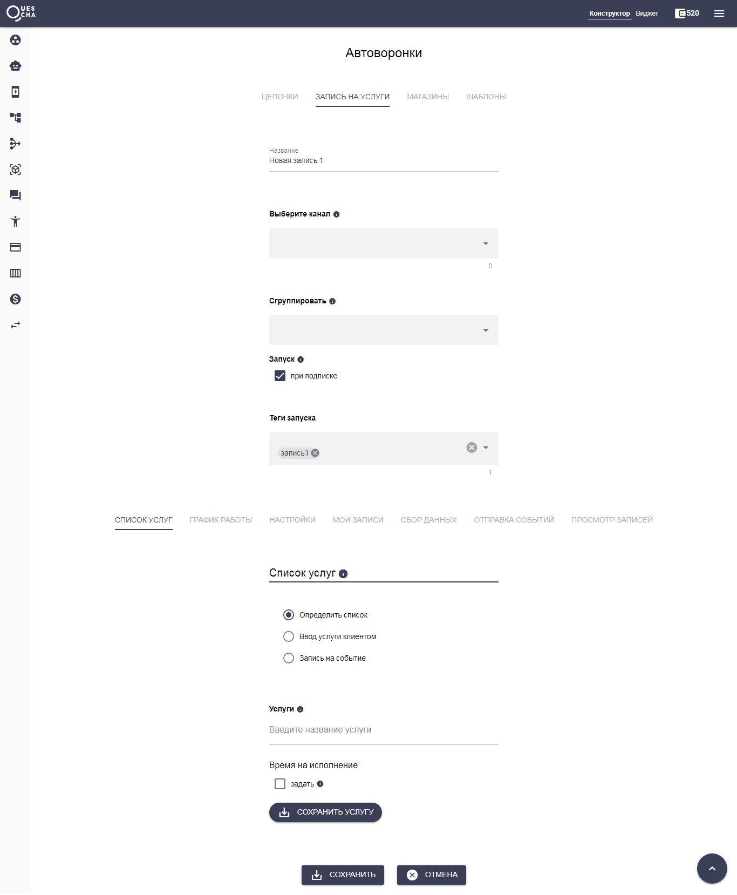

# Модуль записи на услуги

Для того, чтобы запустить чат-бота записей на услуги в мессенджере и бот-лендинге, на странице Автоворонки перейдите на вкладку Запись на услуги и нажмите Добавить запись на услуги

Подключите каналы для работы чат-бота записи.

Следуйте подробным настройкам с пояснениями и сформируйте свой модуль записей на услуги.

Проверьте работоспособность своего бота.


Все собранные в сценарии Записи данные можно получить в подключенном сценарии действий из переменных #{data1..n}, где n зависит он того, сколько дополнительных данных вы собираете

