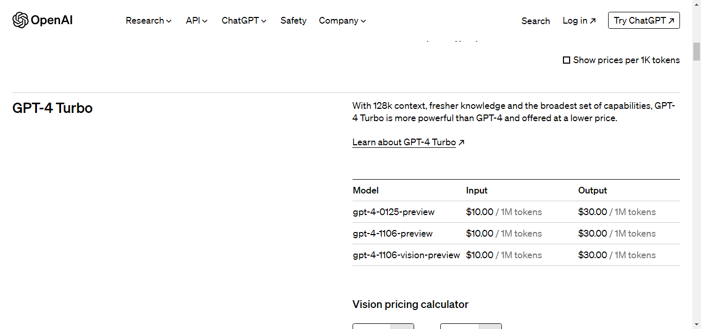
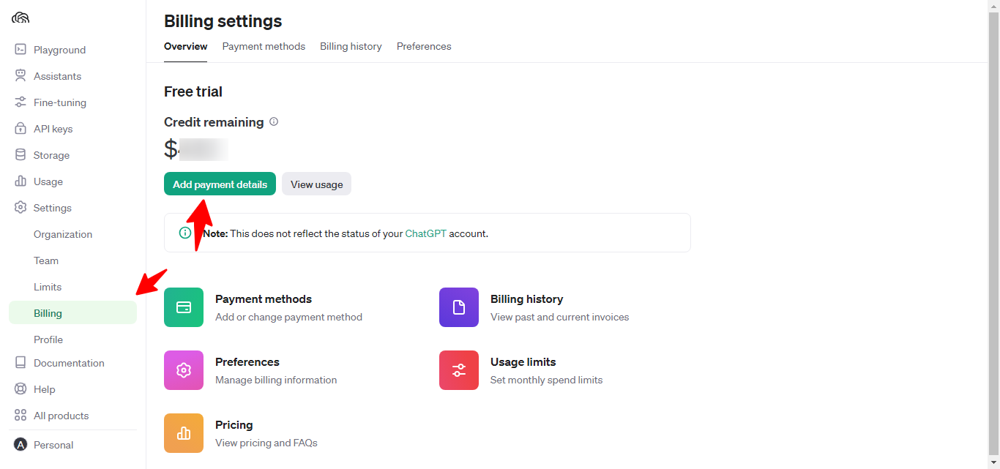
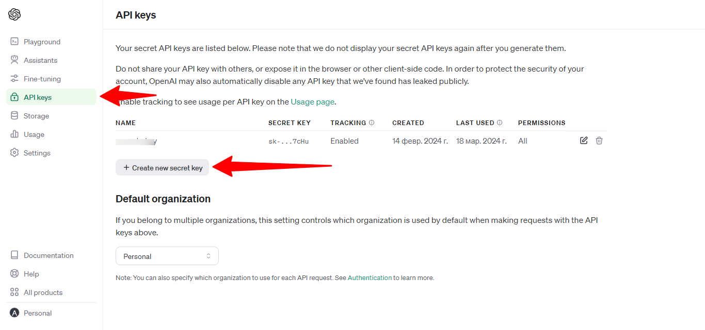
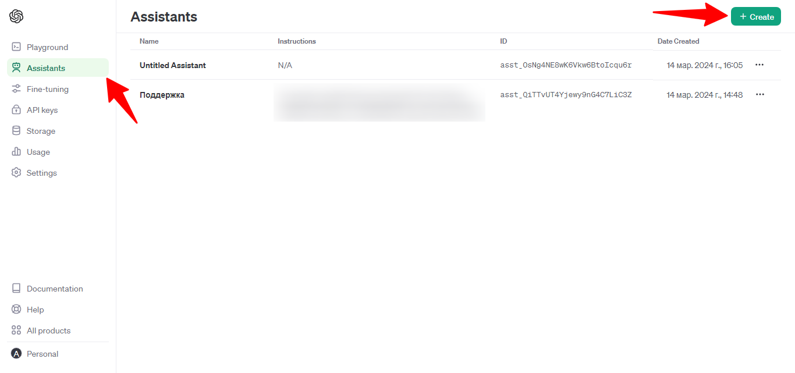

# OpenAI Assistant

В конструкторе вы можете обучить нейросеть ChatGPT на своих данных. Для этого вам потребуется аккаунт в openai.com.

Пополнив баланс аккаунта openai.com вы будете иметь доступ к новейшим моделям ChatGPT 4 и ChatGPT 4 Turbo. В бесплатной версии вы получите доступ к API на 3 месяца с балансом 5$ и доступом к моделям ChatGPT 3.5.

<figure><figcaption>
<a href="https://openai.com/pricing">https://openai.com/pricing</a>
</figcaption></figure>

Баланс openai.com для работы с API пополняется на странице [https://platform.openai.com/account/billing/overview](https://platform.openai.com/account/billing/overview)

<figure><figcaption></figcaption></figure>

Для работы с аккаунтом openai.com потребуется API ключ. Его можно сгенерировать в аккаунте.

<figure><figcaption></figcaption></figure>

Далее нам нужно добавить нашего ассистента.

<figure><figcaption></figcaption></figure>

Выберите модель нейросети. Включите опцию Retrieval. Добавьте файлы с данными для обучения нейросети, а также инструкцию о том, как нейросеть должна обрабатывать входящие запросы.

<figure><figcaption></figcaption></figure>

Отладить работу ассистента вы можете на странице Playground. Отправляйте предполагаемые запросы в чате и проверьте качество ответов. Корректируйте данные в файле и инструкции для достижения желаемого результата.

<figure><figcaption></figcaption></figure>

На стороне конструктора в сценарии действий добавьте действие Нейросеть ChatGPT и выберите Вид нейросети Assistant. Далее укажите API ключ, ID ассистента, отправляемый запрос к нейросети и сохраните ответ от нее в переменную. Ниже выведите переменную ответа в сообщении, которое будет возвращено в сценарий и отправлено в бот.

<figure><figcaption></figcaption></figure>

Сценарий действий прикрепите перед запуском нужного блока, а в сообщении блока укажите шаблон \[Actions], который будет заменен на возвращаемое из сценария действий сообщение.
