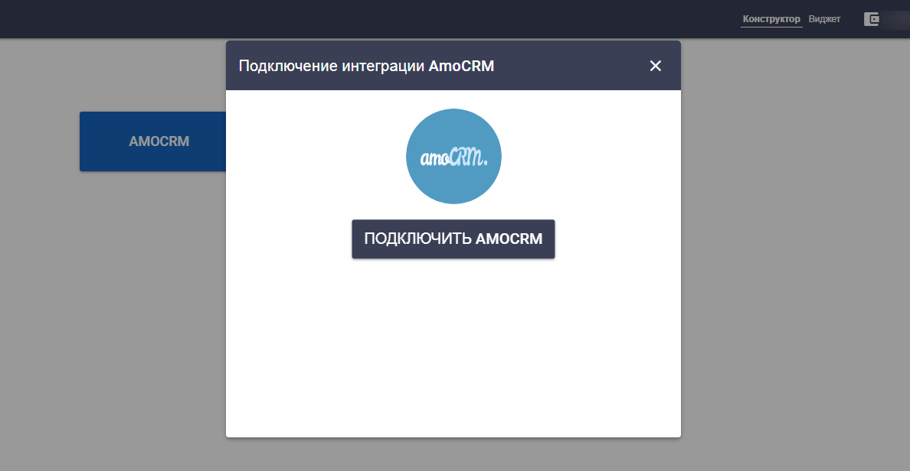
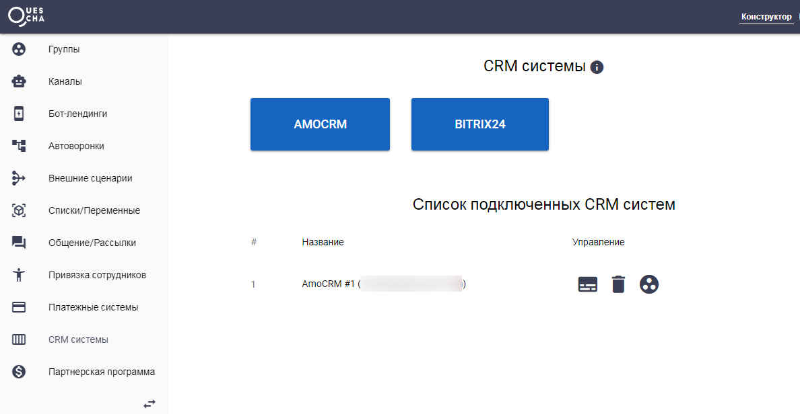
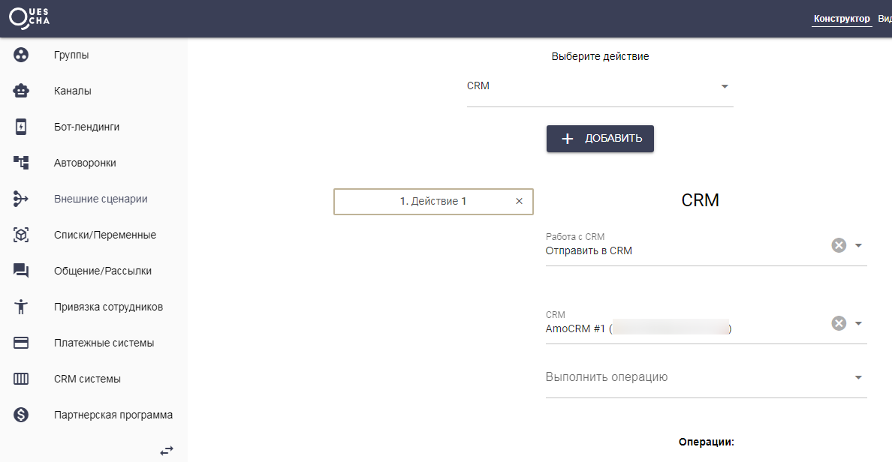
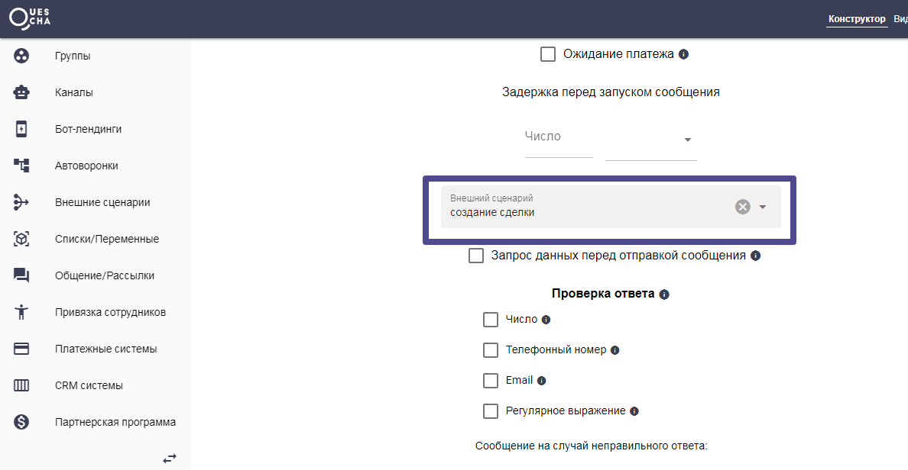

# amoCRM

Интеграция с amoCRM устанавливается из аккаунта Квесчи, для этого перейдите на страницу CRM системы и подключите свой аккаунт amoCRM. Также для отображения виджета в карточках сделки и контакта, вам нужно открыть установленное приложение Quescha в амоМаркете (или интеграциях), ввести логин и нажать Сохранить.

Далее вам необходимо указать требуемые действия в сценарии действий и подключить его в вашу автоворонку.

   

Для приема вебхуков из amoCRM подключение сценария действий к автоворонке не требуется.

Пример настройки сценария по созданию сделки и контакта с нуля:


