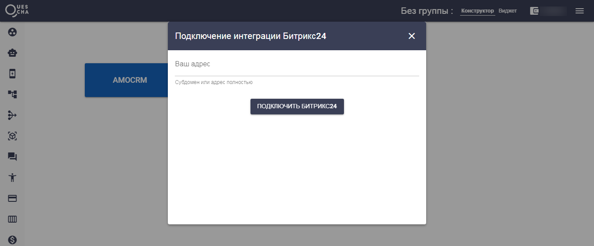

# Битрикс24

Для установки интеграции Битрикс24, сначала установите приложение в маркете аккаунта Битрикс24.

Перейдите на страницу CRM системы в сервисе Квесча и подключите ваш аккаунт Битрикс24.


На бесплатном тарифе Битрикс24 интеграция работать не будет


Далее укажите требуемые действия в сценарии действий и добавьте его в свою автоворонку.

 .png>)

Для приема вебхуков из Битрикс24 подключение сценария действий к автоворонке не требуется.

Настройка сценария по созданию сделки и контакта с нуля:



