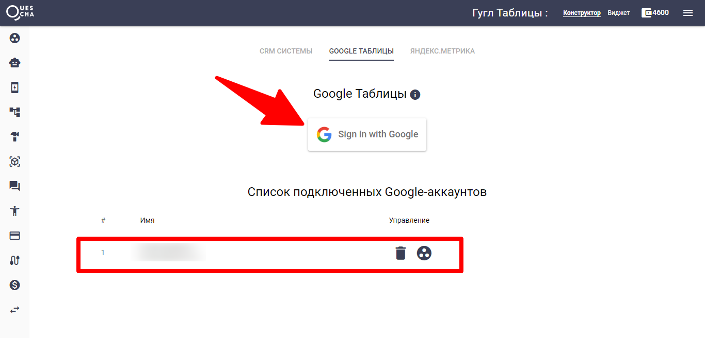
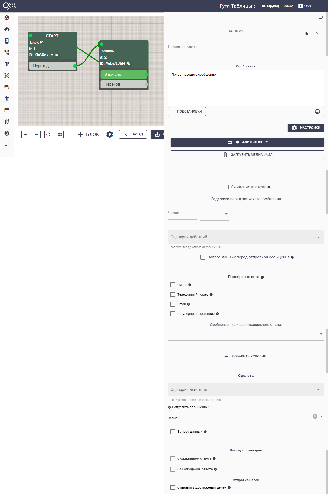

# Google Таблицы

Интеграция с гугл-таблицами довольно часто используется в работе чат-ботов.

Конструктор позволяет:

* Читать данные
* Добавлять данные
* Изменять данные

Разберем простой пример с записью ответа подписчика в таблицу.





Прежде всего добавим интеграцию гугл-аккаунта. Также управлять таблицей можно с помощью [сервисного аккаунта](podklyuchenie-servisnogo-akkaunta-google.md).

При предоставлении доступа не забудьте отметить галочку разрешения использовать Google Таблицы.

<figure><figcaption></figcaption></figure>


Если вы забыли отметить галочками доступ к Google Таблицам, то удалите интеграцию из аккаунта Квесчи и приложение Quescha на странице [https://myaccount.google.com/permissions](https://myaccount.google.com/permissions). Добавьте интеграцию в аккаунт Квесчи заново


Создадим сценарий действий, где будем записывать данные в таблицу.

Нам потребуется ID гугл таблицы, с которой мы будем работать. Получить его можно из URL. Выглядит он примерно вот так:

https://docs.google.com/spreadsheets/d/**1\_r5JCYmtIFYCDJRyANr60Gh3hARY5cgTeKOk54\_dY9M**/edit#gid=0

Также обязательным является заполнение шапки таблицы, а именно, первой строки названиями столбцов. Они понадобятся для работы.

<figure><figcaption></figcaption></figure>

В конце действия вы можем отметить Выход, а можем и не отмечать. Если нет перехода на другие действия, выход будет произведен автоматически.

**Далее создадим цепочку**

В цепочке будет 2 блока. В первом мы будем ожидать сообщение, ко второму блоку мы привяжем сценарий действий, который будет записывать полученный ответ в таблицу.

<figure><figcaption></figcaption></figure>

<figure><figcaption></figcaption></figure>

<figure><figcaption></figcaption></figure>

<figure><figcaption></figcaption></figure>

Чат-бот готов. Не забудьте запустить цепочку!

Файл сценария




Первый столбец в таблице не может быть пустым! Иначе, при добавлении новой строки, последняя строка с данными будет перезаписана. Учитывайте эту особенность.

