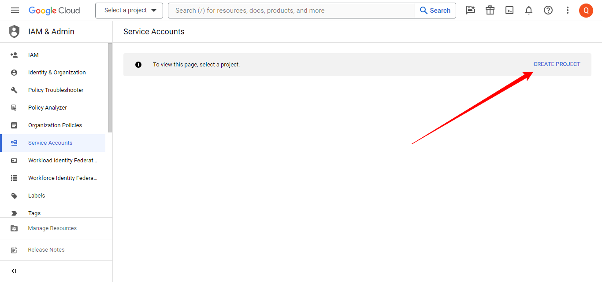
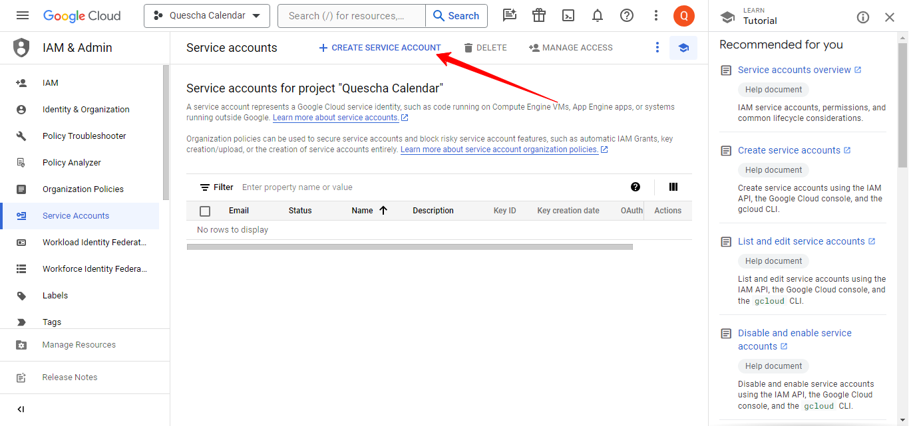
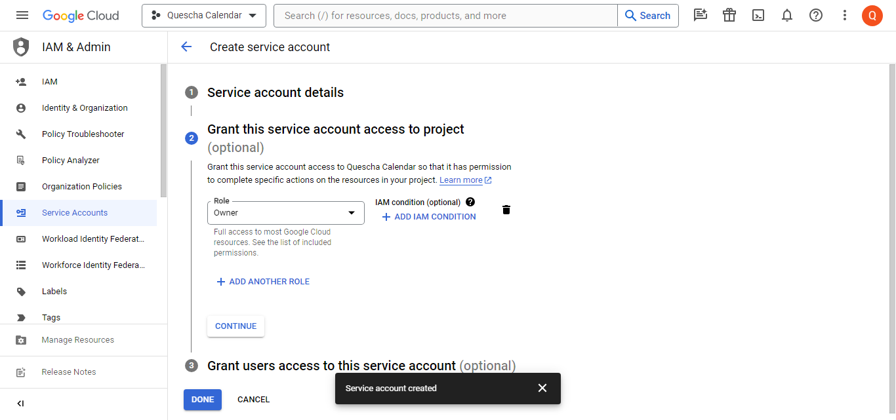
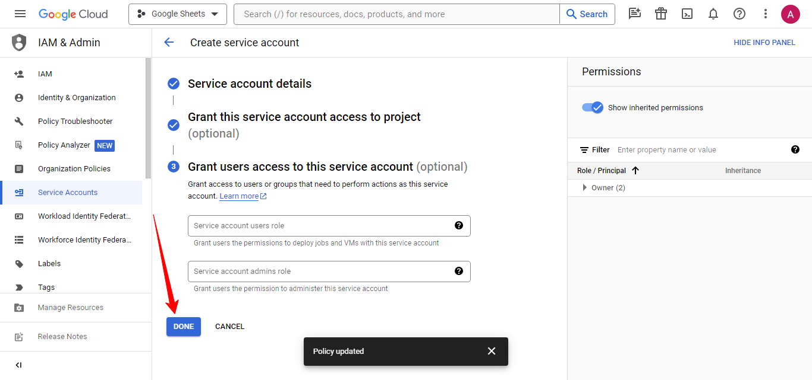
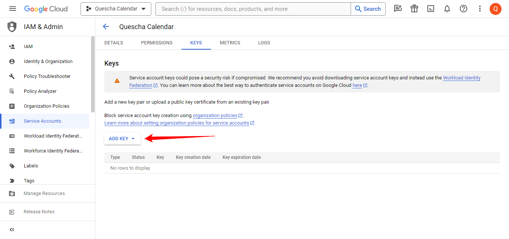
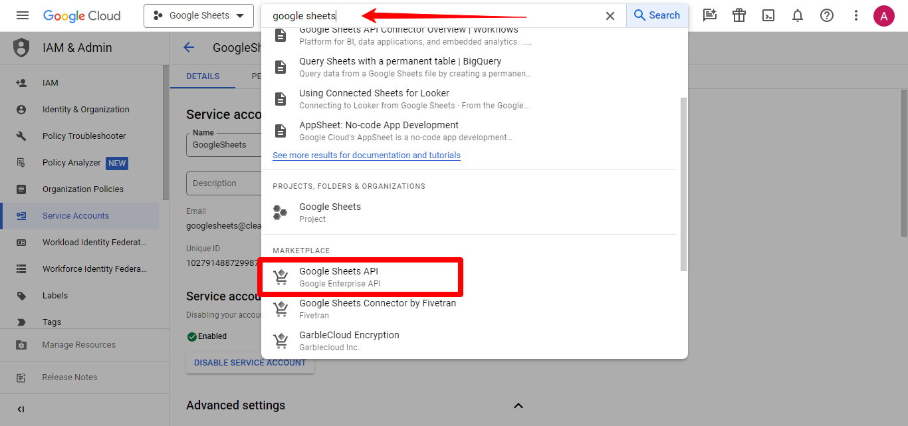
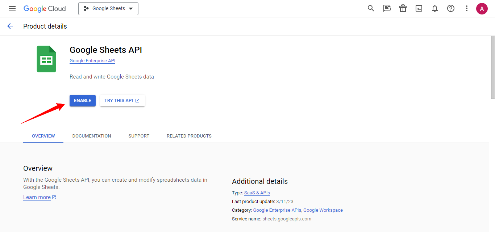
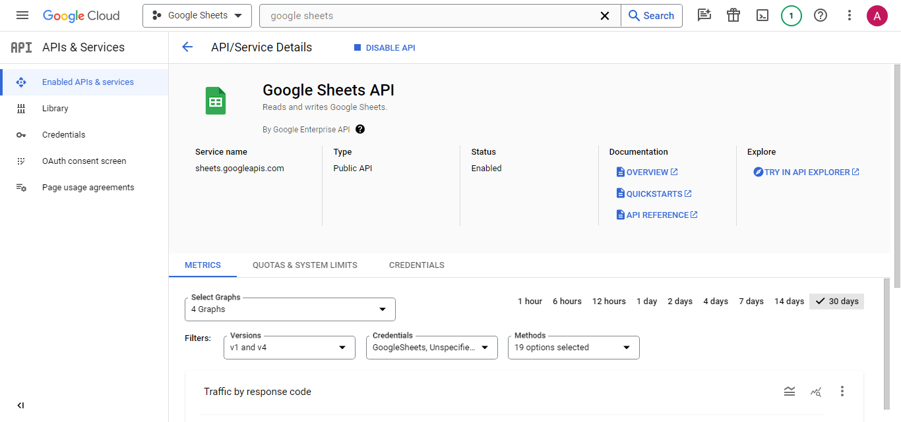
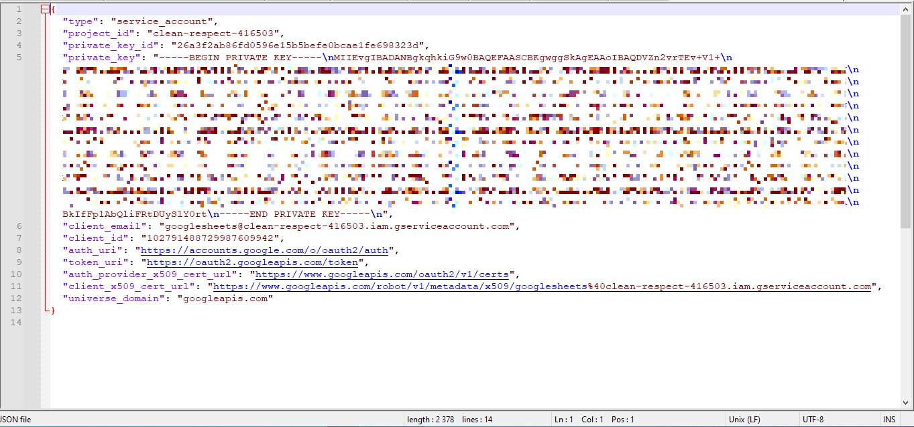
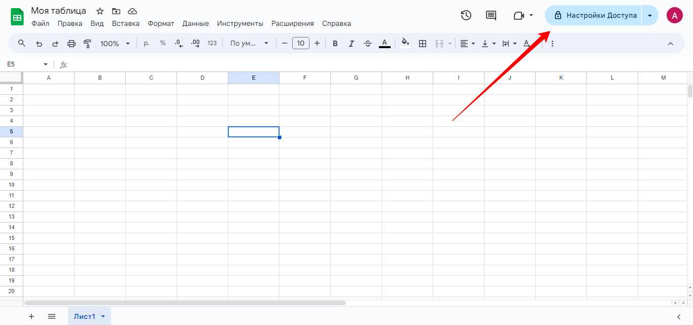

# Подключение сервисного аккаунта Google

Для работы с Гугл Таблицей вы можете использовать, подключенный на странице интеграций Гугл аккаунт, но вы также можете использовать свой **сервисный гугл аккаунт.**

Давайте создадим его.

Перейдите на страницу [https://console.developers.google.com/iam-admin/serviceaccounts?hl=ru](https://console.developers.google.com/iam-admin/serviceaccounts?hl=ru) и нажмите кнопку Create Project.

<figure><figcaption></figcaption></figure>

<figure><figcaption></figcaption></figure>

После этого нажмите кнопку Create Service Account

<figure><figcaption></figcaption></figure>

При создании, предоставьте сервисному аккаунту права владельца.

<figure><figcaption></figcaption></figure>

<figure><figcaption></figcaption></figure>

После создания нажмите на емэйл сервисного аккаунта, чтобы открыть настройки

<figure><figcaption></figcaption></figure>

Перейдите на вкладку KEYS и создайте JSON файл с ключами

<figure><figcaption></figcaption></figure>

<figure><figcaption></figcaption></figure>

<figure><figcaption></figcaption></figure>

<figure><figcaption></figcaption></figure>

Теперь необходимо включить доступ к API Гугл Таблицы для этого сервисного аккаунта.

Введите в поле поиска calendar  и найдите Google Sheets API

<figure><figcaption></figcaption></figure>

Включите доступ, нажав на кнопку Enable

<figure><figcaption></figcaption></figure>

<figure><figcaption></figcaption></figure>

Теперь, чтобы использовать сервисный аккаунт в сценарии действий откройте json файл скопируйте содержимое и вставьте в поле сервисного аккаунта в действии Google Таблицы.

Откройте файл с ключами в текстовом редакторе, скопируйте содержимое и вставьте.

<figure><figcaption></figcaption></figure>

Теперь в сценарии действий вставьте содержимое файла в поле Сервисный аккаунт

<figure><figcaption></figcaption></figure>

Также необходимо предоставить сервисному аккаунту доступ к редактированию вашей таблицы. Скопируйте почту сервисного аккаунта.

<figure><figcaption></figcaption></figure>

Откройте вашу гугл таблицу, нажмите в правом верхнем углу на кнопку Настройки доступа и добавьте этот адрес эл. почты в поле пользователей, которым предоставляются права управления таблицей

<figure><figcaption></figcaption></figure>

<figure><figcaption></figcaption></figure>

Теперь вы можете настраивать сценарий действий по работе с вашей Гугл таблицей
