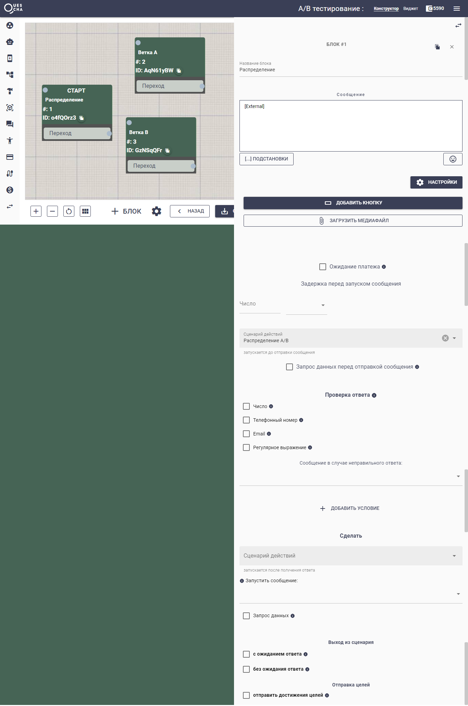
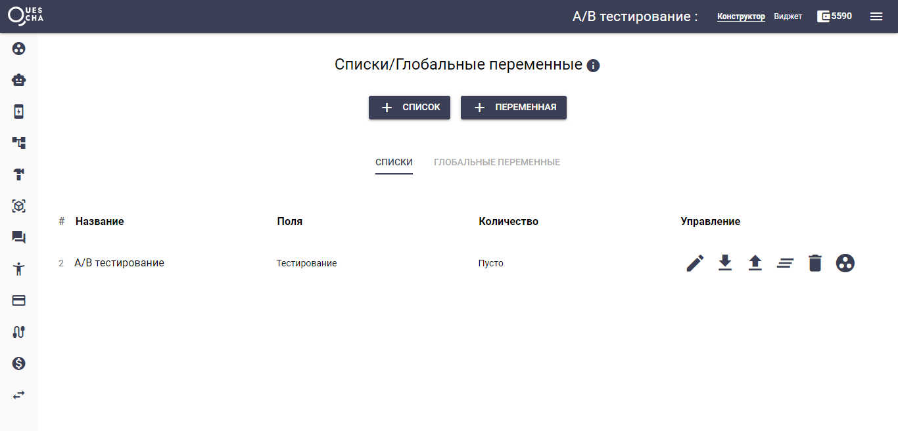
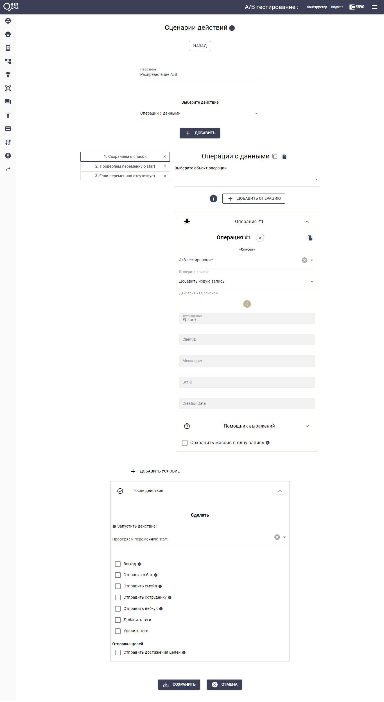
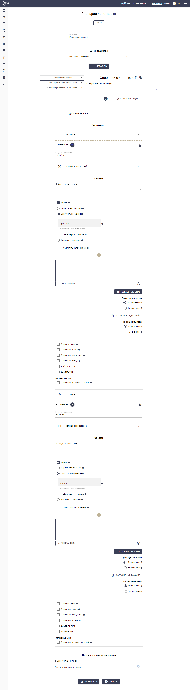
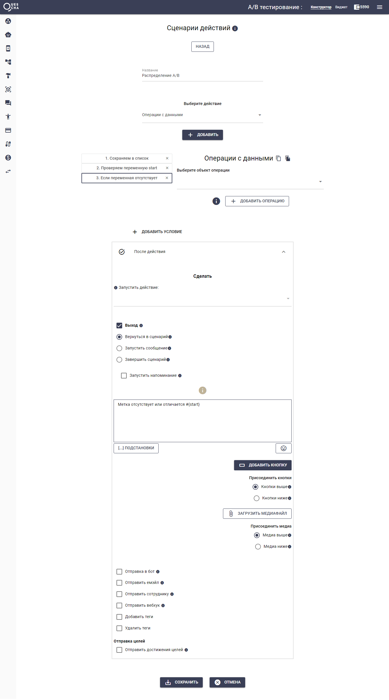

# A/B тестирование

Вы можете захотеть протестировать эффективность вашей автоворонки. У вас может быть 2 разных цепочки (может и больше), которые вы хотите сравнить. Или у вас есть 2 ветки на доске.

Мы также можем тестировать задавая метку во входящем параметре или же делать случайное распределение в сценарии.

Сейчас мы разберем A/B тестирование 2 разных веток по входящему параметру из URL.

Допустим у нас есть ссылка на бот https://t.me/mybot

Добавим к ссылке параметр start который будет в одном случае равен **a**, в другом равен **b.**

Таким образом, у нас будет 2 ссылки по которым мы будем привлекать подписчиков: https://t.me/mybot?start=a и https://t.me/mybot?start=b

При переходе в бот Квесча автоматически создает переменную start, в которую помещает переданный параметр. Нам остается лишь создать условие на стартовом блоке, чтобы направить подписчика на нужную ветку.

Создадим цепочку с блоками.

<figure><figcaption></figcaption></figure>

К стартовому блоку подключим сценарий действий где будет происходить распределение и запись варианта тестирование в список для будущей аналитики.

Создадим список с полем Тестирование. Поля ClientID, Messenger, BotID и время создания записи заполнятся автоматически.

<figure><figcaption></figcaption></figure>

Далее создаем сценарий действий

Первое действие - запись переменной start в список

<figure><figcaption></figcaption></figure>

Во втором действии создаем 2 условия для проверки и перенаправления на нужный блок

<figure><figcaption></figcaption></figure>

В третьем действии выводим сообщение, что переменная start отсутствует или отличается он a/b (необязательно)

<figure><figcaption></figcaption></figure>

Готово. Высоких вам конверсий!



