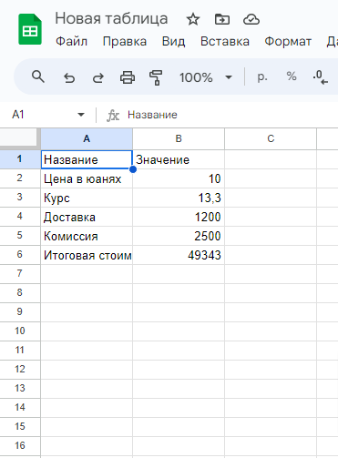

# Бот для вычислений на стороне Гугл Таблицы

Архив с ботом, где у подписчика запрашивается какое-то число, это число подставляется в Гугл Таблицу, где в ячейках настроена формула расчета итоговой стоимости.

<figure><figcaption></figcaption></figure>

Для использования замените Гугл аккаунт и ID таблицы на свои. Это делается в сценарии действий.



