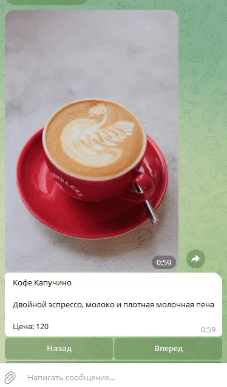

# Готовые сценарии

Вы можете загрузить в свой аккаунт подготовленные сценарии, изучить их и внедрить в свою автоворонку.


Для тестирования достаточно импортировать архив через настройки аккаунта (только оплаченный аккаунт) и подключить канал


#### Работа сценария

Демонстрация принципа работы сценария. В первом сообщении выполняется сценарий. Следующее сообщение в цепочке не придет до тех пор, пока бот не выйдет из сценария, тогда через 1 минуту придет следующее сообщение  в цепочке.



#### Служба поддержки в боте

Иногда в работе чат-бота требуется подключение реального человека.

Это обновленный вариант бота, который потребует минимум усилий для запуска.&#x20;

Вам потребуется добавить 2 бота в разделе Каналы для основного бота и для бота сотрудника поддержки.

Импортируйте архив бота в аккаунт и привяжите добавленные каналы, один к цепочке Основной бот, второй к цепочке Бот сотрудника поддержки. После этого запустите сначала бот сотрудника, затем основной бот и протестируйте его работу.




Если вы хотите заменить сотрудника поддержки - очистите список Сотрудники поддержки

Если у вас изменился канал основного бота, очистите список Основной бот


Еще один вариант поддержки (устаревший)

После импорта вам потребуется заменить данные менеджера для отправки сообщений. В сценарии действий "Подключение менеджера 2" перейдите во действия "Прием файла", "Прием картинки", в адресатах замените текущего на свои данные, в действии "Переписка продолжается" внизу в блоке "Отправка в бот", вы должны также заменить текущего адресата на свои данные. ClientID можно узнать в базе подписчиков нажав на нужного подписчика. BotID вы сможете скопировать на странице "Каналы".





#### Периодический запуск

Если вам требуется в работе вашего чат-бота периодические действия, то вы можете изучить как работает предложенный нами сценарий. В нем действия вызываются каждую минуту (периодичность вы можете изменить самостоятельно).



#### Пересылка файлов

Если вам требуется принимать файлы от подписчика, изучите предложенный нами вариант.

Файлы принимаются и пересылаются на указанные данные. Чтобы сценарий заработал у вас, замените данные отправки на свои.



#### Отправка в amoCRM

Демонстрация отправки сообщения в amoCRM. Для работы подключите свою CRM и замените CRM в сценарии действий "Работа с CRM" в обоих действиях, а также замените id пользователя в операции добавления примечания в сделку, который вы сможете взять в "Помощнике сущностей".



#### Пагинация из списка с картинками

Сценарий считывает список и постит сообщение вместе с картинкой. Строки списка можно перелистывать вперед и назад. Отправка сообщения происходит с заменой предыдущего.

<figure><figcaption></figcaption></figure>



#### Пагинация из списка с корзиной

В сценарии используется список с товарами, картинки к товарам, корзина, генерация платежной ссылки. После импорта вам потребуется привязать канал чат-бота, а также добавить свою платежную систему и заменить ее в сценарии действий "Корзина".

<figure><figcaption></figcaption></figure>



#### Реферальная система

Готовый сценарий реферальной системы, которая позволяет регистрировать реферала по ссылке, получать реферальную ссылку, смотреть баланс, листать список рефералов, отправлять сообщение реферальной сети.

После импорта подключите канал к цепочке и замените ссылку на бота в сценарии действий "Получение реферальной ссылки"

<figure><figcaption></figcaption></figure>



Реферальная система с возможностью отправки сообщения всем рефералам



Добавлена возможность отправлять файл, фото, аудио и видео



#### Пагинация списка одним блоком

Реализация пагинации в одном блоке



#### Магазин Web App Telegram по доставке еды



#### Магазин одежды Web App Telegram



#### Запись на маникюр Web App Telegram



#### Контроль выездных сотрудников

Бот уведомляет работников о необходимости начать и закончить рабочий день. В начале дня необходимо отправить свою геолокация и указать объект в котором производятся работы. В конце дня необходимо прислать фото объекта.



#### Яндекс Диск

Бот загружает фото на Яндекс Диск и выводит сохраненные фото пользователя. Вам необходимо добавить свой Яндекс аккаунт на странице интеграции и после установки бота привязать свой аккаунт в сценарии действий.


