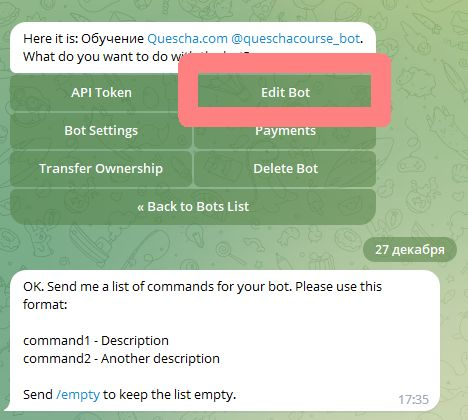
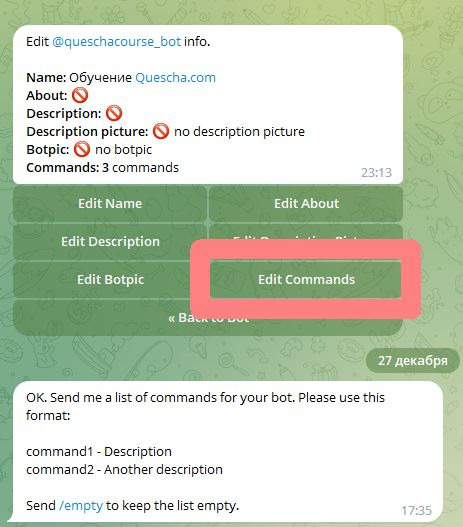
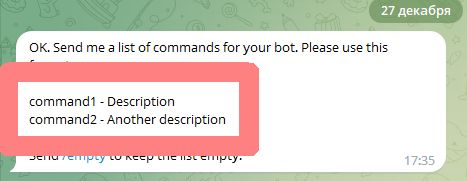

# Меню в боте

Разберем ситуацию, когда нам надо, чтобы меню в боте запускало нужные нам цепочки.

<figure><figcaption></figcaption></figure>

У нас будет три пункта меню, давайте их сделаем через @botfather

Переходим в botfather, выбираем наш бот далее Edit Bot -> Edit commands

<figure><figcaption></figcaption></figure>

<figure><figcaption></figcaption></figure>

<figure><figcaption></figcaption></figure>

Формируем наше меню одним сообщением с переносом строк как показано на скриншоте.

Меню готово и должно появиться в боте. Но пока оно никак не реагирует на нажатия. Необходимо связать пункты меню с цепочками в боте.

Создадим три цепочки, добавим каждой цепочке запуск по ключевым словам, где мы укажем наши команды из @botfather вида /command

<figure><figcaption></figcaption></figure>

<figure><figcaption></figcaption></figure>

После этого назначения цепочки будут запускаться из меню.

Наше меню готово.

## Меню в одном сценарии

Если мы хотим, чтобы команды запускали блоки в одном сценарии, то мы должны добавить все команды вида /command в настройки запуска цепочки по ключевым словам, т.е. все команды добавляем в одну цепочку.

После этого в стартовом блоке добавьте условия обрабатывающие ответ блока. Например: '\[Answer]' = '/command1' и выберите запуск нужного блока. В этом случае, после команды /command1 будет запущен указанный вами блок в одном сценарии.

