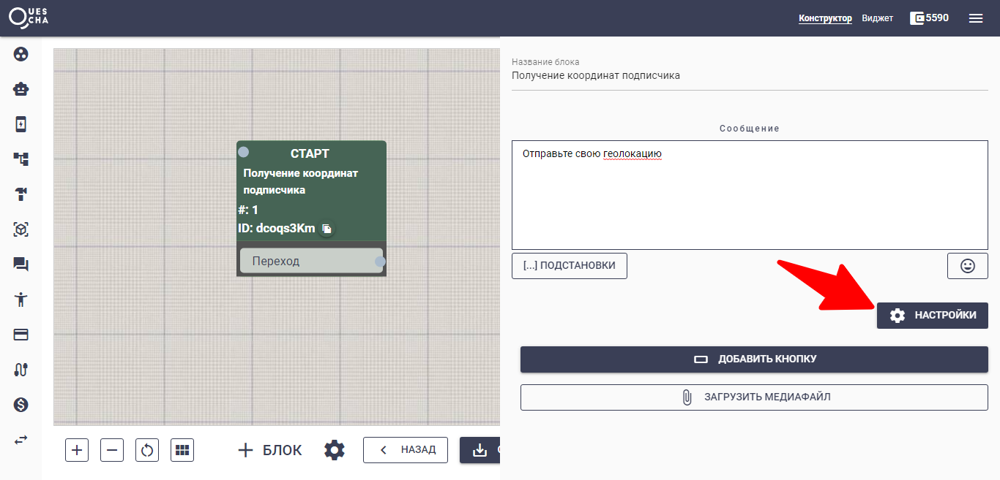
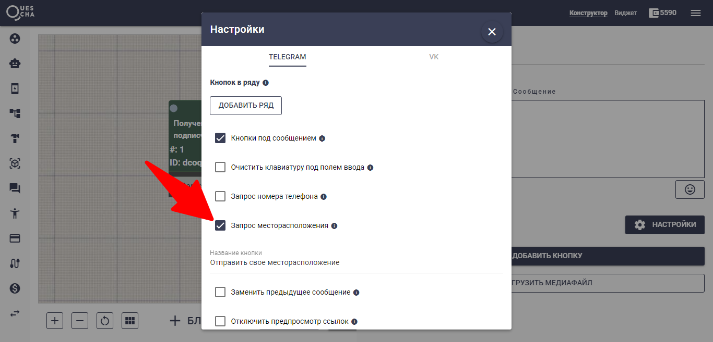
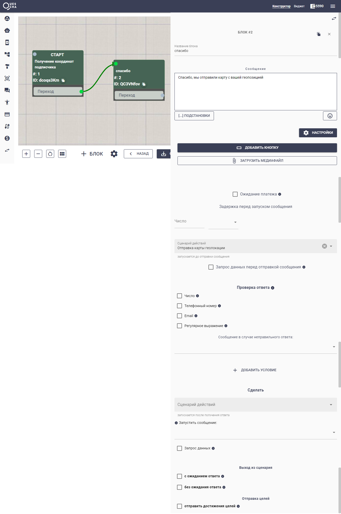

# Отправка карты геолокации (Телеграм и WhatsApp)

Разберем как получать геолокацию от пользователя и как отправлять карту в бот.

Создадим цепочку и сообщение, где будем запрашивать координаты подписчика

<figure><figcaption></figcaption></figure>

<figure><figcaption></figcaption></figure>

<figure><figcaption></figcaption></figure>

После отправки пользователем своего месторасположения, мы получаем координаты широты и долготы, которые помещаются в переменные #{client\_latitude} и #{client\_longitude} соответственно.

Воспользоваться переменными мы можем только в сценарии действий, поэтому создадим сценарий действий.

<figure><figcaption></figcaption></figure>

В секции Отправка в бот мы указываем данные получателя карты (например менеджера/администратора).

В тексте сообщения выбираем из подстановок шаблон отправки карты **\[SendLocation(#{client\_latitude},#{client\_longitude})],** где в качестве широты и долготы указываем полученные от пользователя переменные.

Теперь нам нужно создать новый блок в сценарии и добавить туда наши действия "до отправки сообщения".

<figure><figcaption></figcaption></figure>

Все готово. Теперь вы можете использовать это не только для бизнеса, но и для отслеживания геолокации ваших близких:)

Если вы хотите отправить карту подписчику, вам потребуется указать координаты широты и долготы. Самый простой способ это зайти на Яндекс.Карты, найти нужную геопозицию и скопировать координаты, далее указать их в шаблоне \[SendLocation(широта,долгота)]. Вставьте этот шаблон в сообщение для подписчика. Готово.

<figure><figcaption></figcaption></figure>



