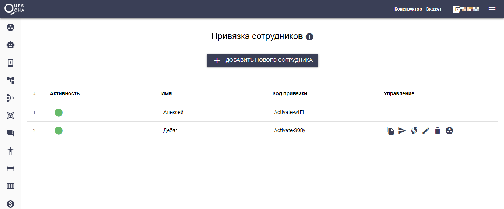
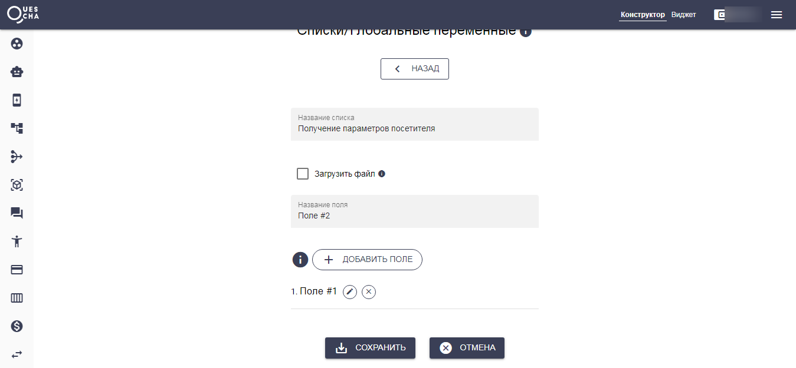

# Отправка собранной информации

Почти в каждом чат-боте возникает необходимость получения собранных данных от клиента в мессенджер сотрудника, администратора, менеджера. На платформе Квесча это можно сделать двумя способами.

### 1. Привязка сотрудников

Первый способ - это добавить сотрудника в любой бот, где он будет получать собранные данные. Для этого необходимо перейти на страницу Привязка сотрудников, нажать кнопку Добавить нового сотрудника, далее сотруднику необходимо перейти в предварительно добавленный в систему бот и ввести код активации вида Activate-S98y.

После привязки необходимо указать сотрудника в месте отправки данных сценария. Сами данные формируются автоматически и включают ответы всех этапов сценария, которые прошел клиент.

.png>)

### 2. Отправка в бот

Второй способ является более свободным, вы сами формируете сообщение для отправки и можете отправить его любому подписчику из базы. Данный способ носит название Отправка в бот.

Если первый способ отправляет данные только после выхода из сценария, то отправить в бот вы можете на любом этапе выполнения сценария.

Настройка отправки в бот находится в сценарии действий в блоке Сделать.

.png>)

Для отправки сообщения в бот, нам потребуются 3 параметра для отправки в мессенджер: ClientID, Messenger и BotID. Для отправки на бот-лендинг потребуется всего один параметр ClientID.

Получить ClientID можно на странице Общение/Рассылки, кликнув на нужного подписчика. В Телеграме есть специальный бот @getmyid\_bot, где можно узнать свой ClientID

Получить BotID можно на странице Каналы.

Значение Messenger для Telegram - telegram, для Viber - viber, для VK - vk.

Также, чтобы узнать параметры сотрудника для отправки ему сообщения, нам потребуется предварительно получить эти данные, сохранив их, например в список. Поскольку данные неизменны, то получив их один раз, вы сможете напрямую добавлять их в адресаты.

 (1).png>)

Итак, у нас уже есть добавленный бот и автоворонка. Переходим на страницу Списки/Переменные и добавляем список с одним полем. Туда мы поместим имя сотрудника, а нужные нам поля ClientID, Messenger, BotID заполнятся автоматически.

Теперь нам необходимо создать сценарий действий, где мы произведем операцию добавления в список. Переходим на страницу Действия и нажимаем кнопку Новый сценарий.

.png>)

Добавляем действие Операции с данными, Объект операции Список, выбираем созданный список, Добавить новую запись. В Поле #1 вводим шаблон ответа на первое сообщение сценария - \[A1] и сохраняем сценарий действий.

Далее нам нужно привязать сценарий действий для его выполнения. Если вы еще не создали цепочку - создайте ее. Перейдите на страницу Автоворонки и нажмите кнопку Новая цепочка сообщений.

.png>)

Нажимаем кнопку Новое сообщение

.png>)

Обратите внимание, что сценарий действий можно подключить в двух местах. Первое место вызывает сценарий действий ДО отправки сообщения. Второе - ПОСЛЕ. В данном случае мы будем запускать сценарий действий после отправки сообщения.

Также обратите внимание на то, что мы должны указать выход из сценария с ожиданием ответа. Если указать выход без ожидания ответа, то сценарий действий, который мы привязали не запуститься. Если не указывать выход из сценария, то сценарий действий также будет запущен, однако сценарий завершен не будет (Это не касается темы данного воркшопа, но стоит сказать, что при незавершенном сценарии, следующие сообщения по цепочке не смогут прийти).

Сохраните сообщение и не забудьте запустить цепочку!

Дайте ссылку на бота своему сотруднику. После ввода своего имени мы получим его параметры в списке.

.png>)

Добавьте их в адресаты блока Отправка в бот, сформируйте сообщение для сотрудника и все готово!

_Если у вас возникли вопросы, не стесняйтесь их задавать в поддержку на странице_ [_https://quescha.com_](https://quescha.com)

