# Передача информации между цепочками/ботами

Почти в каждом боте нам требуется передавать данные от подписчика к менеджеру или администратору.

Рассмотрим передачу данных на примере чата с менеджером. Иными словами это ситуация когда подписчик бота запросил по кнопке переписку с менеджером. Нам требуется передавать сообщения от одного другому, а также передавать файлы и изображения.

Создадим 2 цепочки. Одна цепочка это цепочка бота с кнопкой подключения менеджера. Вторая цепочка это бот менеджера, где он пишет ответы подписчику по кнопке ответить.

<figure>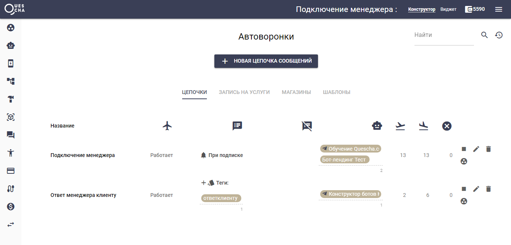<figcaption></figcaption></figure>

Цепочка Подключение менеджера состоит из 3х блоков.

<figure><figcaption></figcaption></figure>

<figure>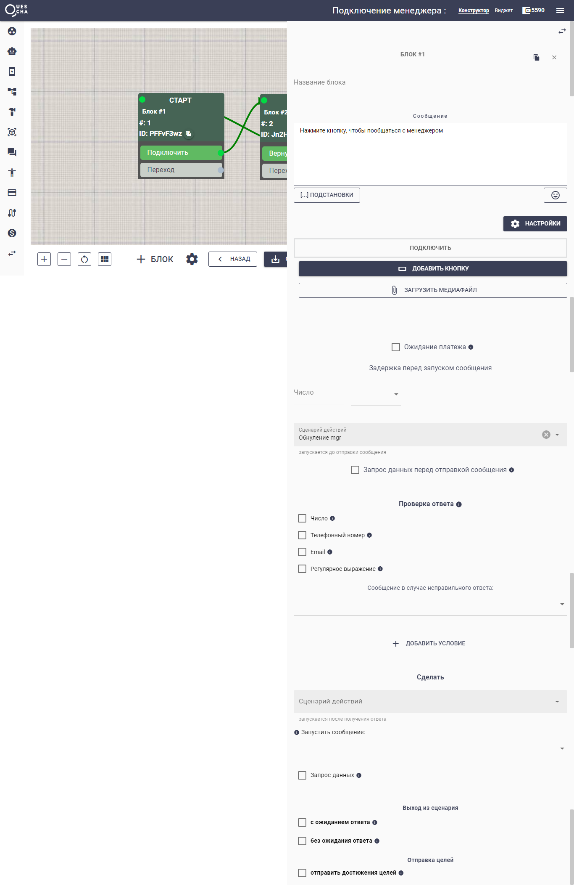<figcaption></figcaption></figure>

В Блоке #1 подписчик может нажать кнопку Подключить и начать переписку с менеджером.&#x20;

Когда подписчик первый раз нажимает кнопку подключить, ему необходимо показывать вводное сообщение. В процессе переписки мы ставим ... (можно ожидайте, подождите, вам пишут и т.п.). Поскольку оба эти сообщения выводим в Блоке #2, мы должны запоминать состояние (первый раз зашел или продолжает переписку). Это состояние мы будем хранить в переменном mgr. Перед нажатием на кнопку Подключить нам необходимо обнулить переменную mgr. Подключим сценарий действий, где переменной mgr присваиваем "ничего".

<figure><figcaption></figcaption></figure>

Блок #2 с помощью сценария действий Подключение менеджера 1 мы выводим подходящее сообщение и ждем сообщение от подписчика.

<figure>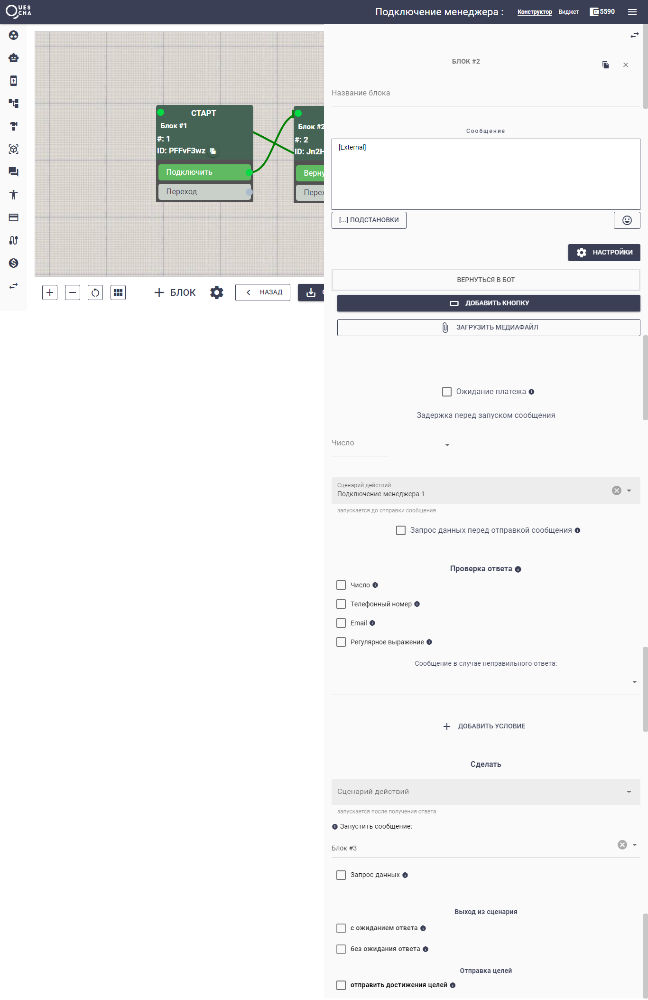<figcaption></figcaption></figure>

<figure>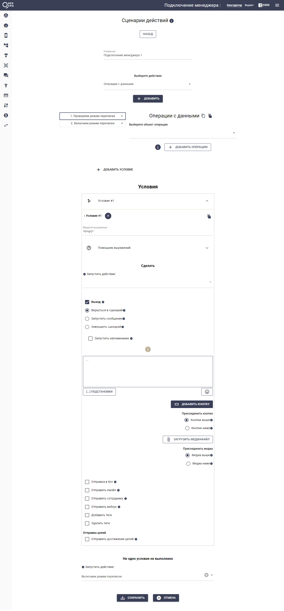<figcaption></figcaption></figure>

<figure>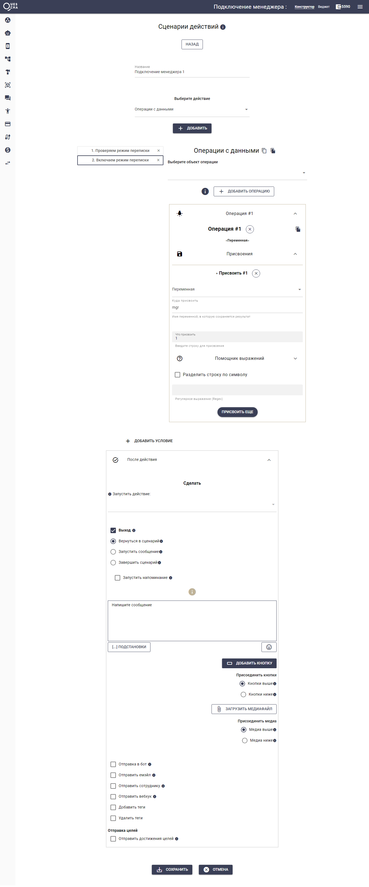<figcaption></figcaption></figure>

В Блоке #3 мы подключаем действие, которое отправляет сообщение в бот менеджера и запускает Блок #2

<figure>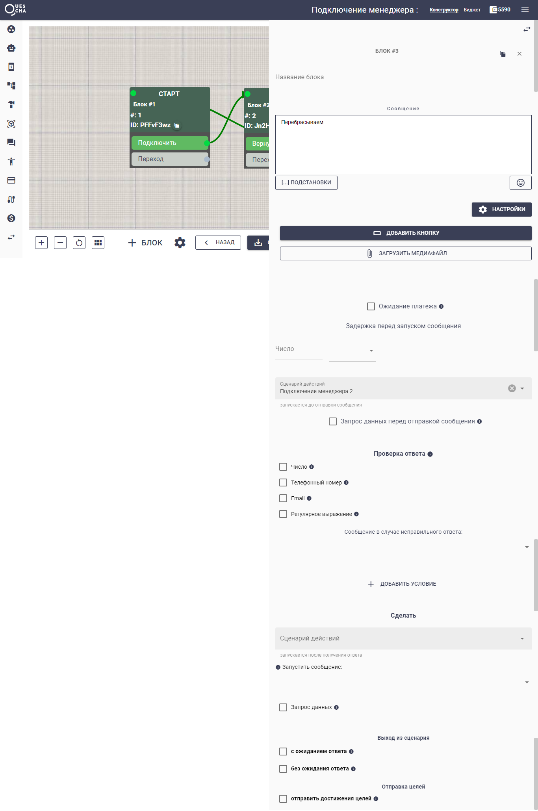<figcaption></figcaption></figure>

Посколько подписчик может отправить файл или изображение или сообщение, то мы сначала принимаем файл и изображение, а затем отправляем сообщение с кнопкой Ответить.

<figure><figcaption></figcaption></figure>

<figure>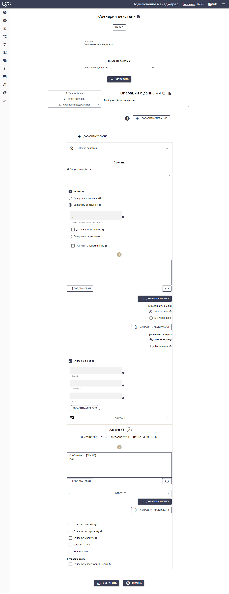<figcaption></figcaption></figure>

В кнопке Ответить мы передаем данные \[ClientID] и \[BotID] для отправки подписчику ответа из бота менеджера

<figure><figcaption></figcaption></figure>


Имейте ввиду, что длина строки с данными ограничена (у разных мессенджеров разная длина). Если сообщение не передается, возможно строка с данными слишком длинная.


В цепочке "Ответ менеджера клиенту" всего два блока, первый выводит инфосообщение "Напишите сообщение для \[Data1] (ClientID)", второй блок отправляет файлы и сообщение подписчику.

<figure>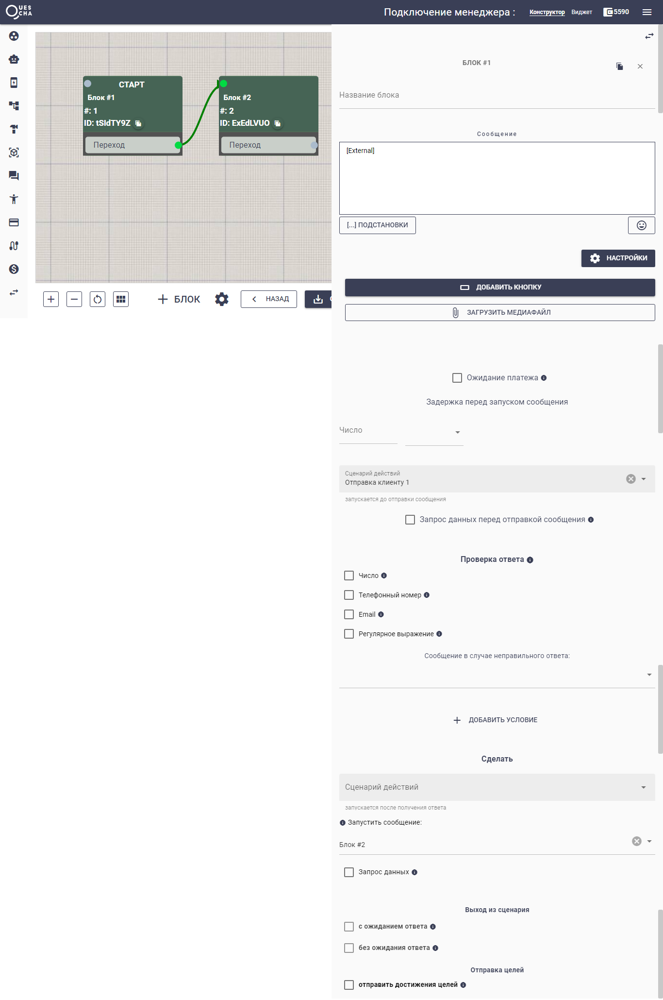<figcaption></figcaption></figure>

<figure>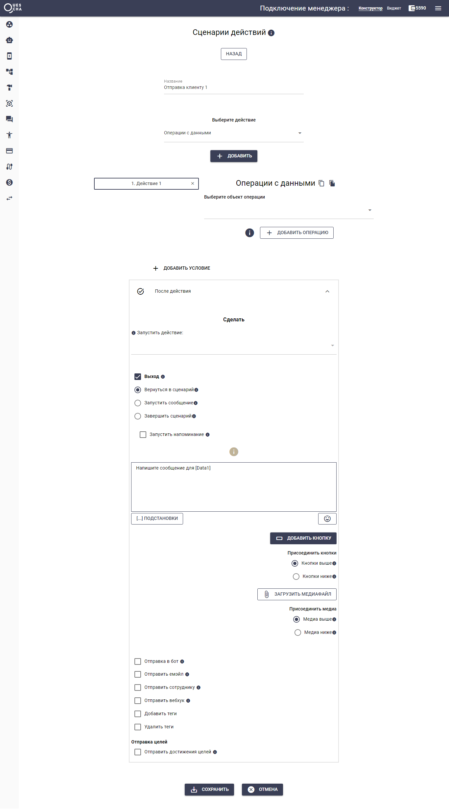<figcaption></figcaption></figure>

<figure>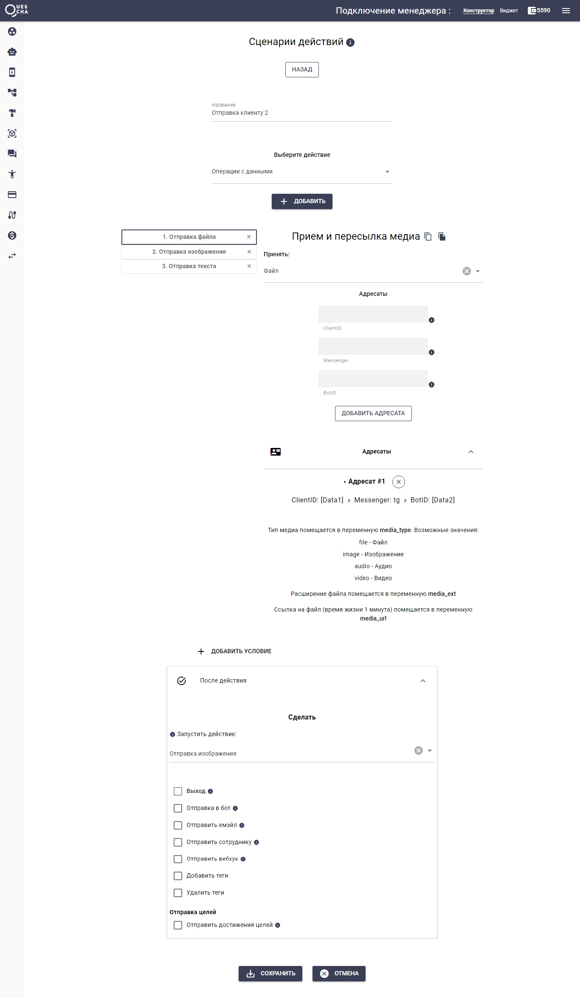<figcaption></figcaption></figure>

<figure>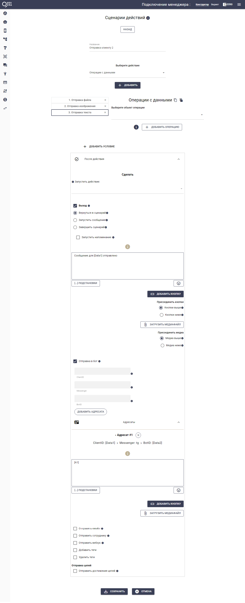<figcaption></figcaption></figure>

На этом сценарий готов к использованию. Если вам осталось что-либо непонятно, то ниже прикрепляем файл сценария. Вы можете загрузить его в свой аккаунт, подключить каналы к цепочкам, протестировать и разобрать сценарий детально. Учтите, что импорт доступен в настройках аккаунта только у оплаченных аккаунтов. Успехов вам!



