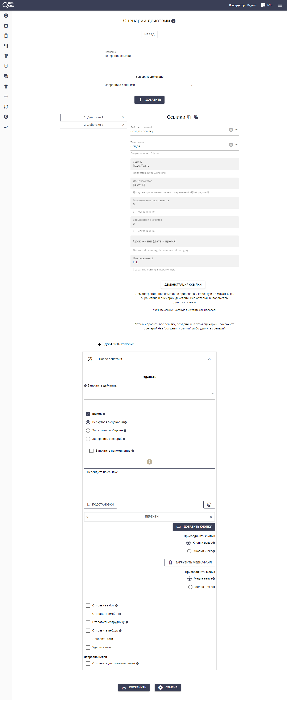
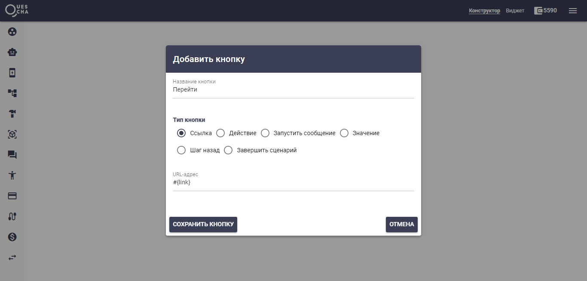
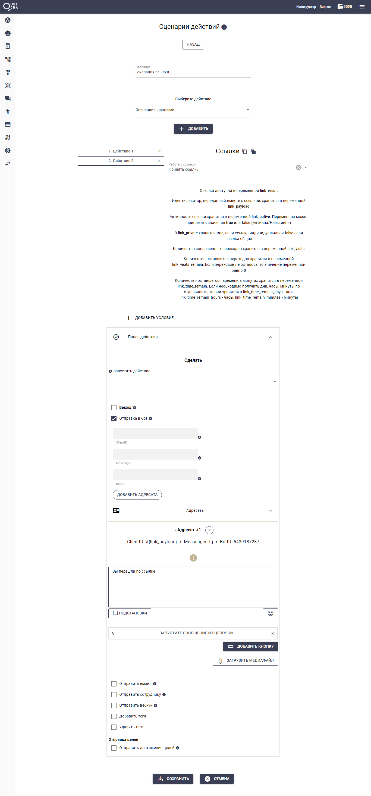
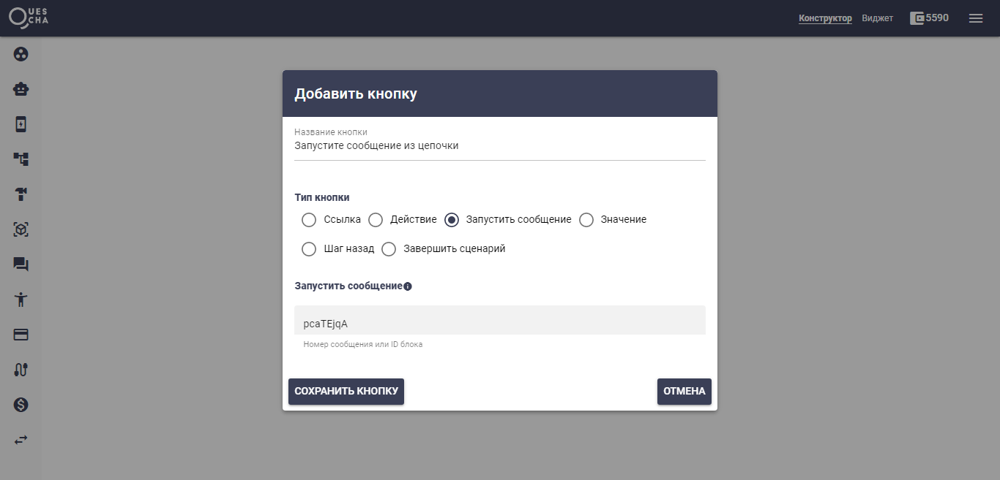
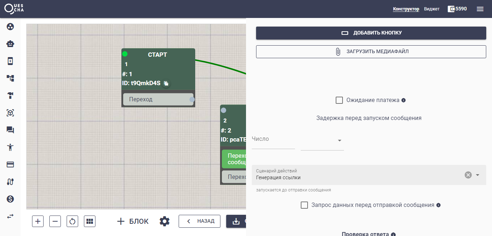

# Продолжение сценария при переходе по внешней ссылке

Вашему боту может потребоваться знать, перешел ли человек по внешней ссылке или нет.

Давайте разберем как это можно сделать.

Прежде всего внешнюю ссылку мы должны сгенерировать в сценарии действий с помощью действия "Ссылки".

Для этого давайте создадим сценарий действий, который затем подключим в месте вывода нашей ссылки в сообщении.

<figure><figcaption></figcaption></figure>

В поле Идентификатор помещаем шаблон нашего клиента, чтобы при переходе мы могли отправить ему сообщение с кнопкой перехода в блок сценария.

Кнопку с названием Перейти мы делаем ссылкой, куда в поле URL-адрес поместим нашу переменную ссылки

<figure><figcaption></figcaption></figure>

Далее добавим в этом же сценарии другое действие, в котором мы будем принимать факт перехода по ссылке и переход в нужный нам блок.

<figure><figcaption></figcaption></figure>

В секции Отправка в бот мы указываем для адресата данные клиента из идентификатора ссылки #{link\_payload}, данные мессенджера "tg" и BotID, который можно взять на странице каналов.

Далее пишем нужное сообщение. Если требуется дальнейшее движение по сценарию, прикрепляем кнопку с переходом на нужный блок.

<figure><figcaption></figcaption></figure>

Сам сценарий действий "Генерация ссылки" подключаем в блоке вывода ссылки, как писалось ранее.

<figure><figcaption></figcaption></figure>

Вот и все. Попробуйте!


Обращаем внимание, что в действии приема ссылки (также как и в приеме вебхука в обмене данных) секция "Выход" работать не будет. Поэтому нужно использовать секцию "Отправка в бот"



Если вы хотите передать несколько данных в идентификаторе ссылки, то перечислите их в строку с разделителем (например |). В действии после приема вы можете разделить переменную #{link\_payload} и сохранить данные в переменные по частям, чтобы использовать их в дальнейшем



