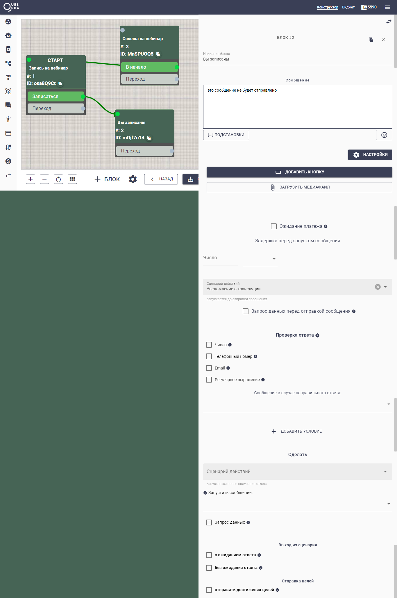
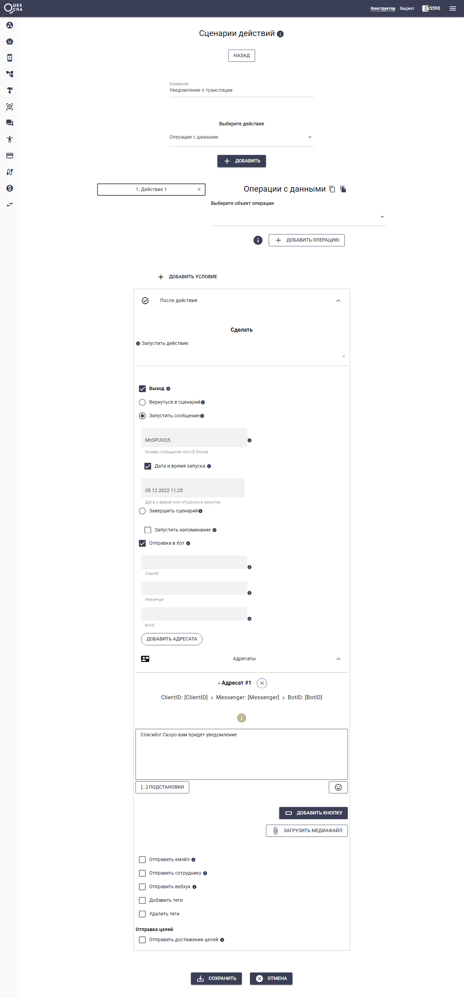

# Уведомление о начале вебинара

Как уведомить всех подписчиков в одно и то же время?

Для этого нам потребуется сценарий действий, в котором мы будем отправлять сообщение о записи на вебинар и планировать отправку сообщения о начале трансляции.

Сначала создадим цепочку сообщений с тремя блоками: Стартовое, Запись на вебинар, Уведомление о начале трансляции.

<figure><figcaption></figcaption></figure>

В блоке #2 мы подключаем сценарий действий, где происходит условная запись на вебинар и планируется отправка уведомления.  При этом мы отправляем в бот сообщение об успешной записи.

<figure><figcaption></figcaption></figure>

Готово. В назначенное время придет сообщение с ссылкой на вебинар.


