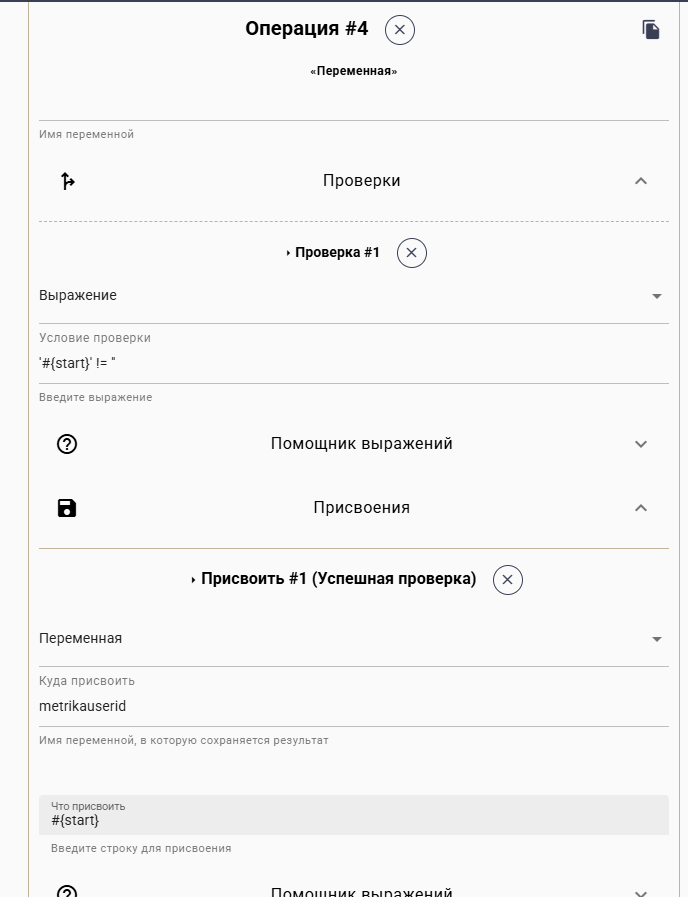
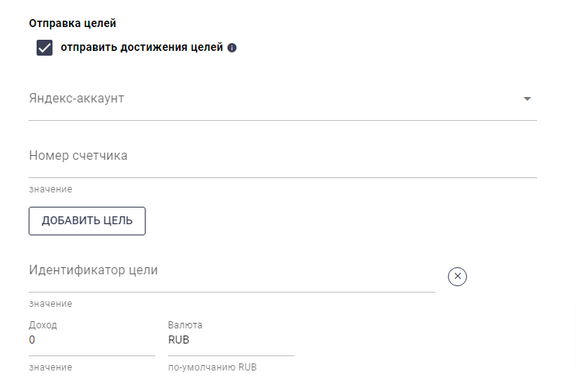

# Отправка целей в Яндекс Метрику

В конструкторе Квесча есть возможность отправлять достижения целей в чат-боте на бот-лендинге (виджете) или мессенджере Телеграм.



Для того, чтобы была возможность отправки целей в боте Телеграм, сначала необходимо привязать посетителя. (Для привязки посетителя на своем сайте [читайте тут](otpravka-celei-iz-bota-cherez-svoi-sait.md))

### Шаг 1. Перенаправление посетителя из бот-лендинга или виджета сайта в бот мессенджера Телеграм.

Вы должны вывести ссылку на свой бот с параметром start, равным ClientID, например, https://t.me/mysuperbot?start=\[ClientID]. Шаблон \[ClientID] будет заменен на ID посетителя. Также, этот ID можно взять из параметров Cookies, для бот-лендинга это quescha\_code\_..., для виджета это quescha\_code\_widget\_...

### Шаг 2. Передача параметра start в переменную metrikauserid

После запуска цепочки бота Телеграм, входящий параметр start становится переменной start. Необходимо присвоить значение переменной start в переменную metrikauserid

Перед присвоением делаем проверку на то, чтобы переменная start не была пуста: '#{start}' !=  ''

<figure><figcaption></figcaption></figure>

### Шаг 3. Отправляйте цели на любом этапе автоворонки.

Достижения целей вы можете отправлять как в самом сценарии, так и в сценарии действий.

Для этого выбираете Яндекс аккаунт, указываете номер счетчика метрики и перечисляете отправляемые идентификаторы целей типа JavaScript-событие

<figure><figcaption></figcaption></figure>
