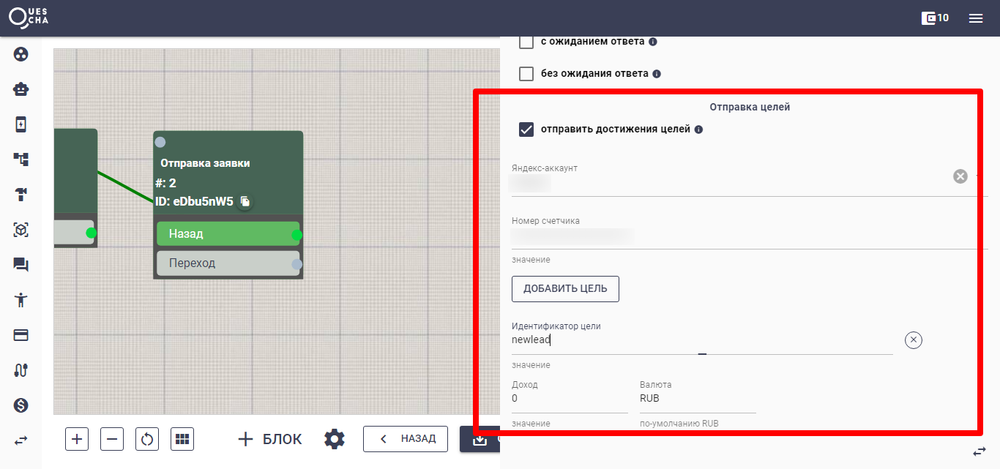

# Отправка целей из бота через свой сайт

Перед настройкой включите оффлайн конверсии в Яндекс.Метрике и подождите сутки до активации


Зайдите в настройки счетчика Яндекс.Метрики -> Загрузка данных и включите учет офлайн-конверсий -> Дождитесь активации офлайн-конверсий


Также в конструкторе добавьте аккаунт Яндекса, в котором находится счетчик метрики для сайта.

На своем сайте с помощью кода JavaScript получаете clientID посетителя сайта из Яндекс.Метрики и помещаете его значение в переменную yaID:

```javascript
var yaID;
ym(XXXXXXX, 'getClientID', function(clientID) {yaID = clientID});
```

где XXXXXXX - номер счетчика вашей метрики.

Присваиваете yaID в userID

```javascript
ym(XXXXXXX, 'setUserID', yaID);
```

Передаете yaID в параметре start в ссылке на ваш бот:

```javascript
var botlink = 'https://t.me/mybot?start=' + yaID;
```

Эту ссылку выводите посетителю сайта, по которой он перейдет в бот.

## Пример кода

```javascript
<script type="text/javascript">
	const counterId = 12345678; // замените на свой счетчик метрики
	const botlink = 'https://t.me/mybot'; // замените на свою ссылку бота, которую вы разместили на сайте
	function waitForYandexMetrika(counterId, timeout = 5000) {
		return new Promise((resolve, reject) => {
			const startTime = Date.now();
			const interval = setInterval(() => {
				if (typeof window['yaCounter' + counterId] !== 'undefined') {
					clearInterval(interval);
					resolve(true);
				} else if (Date.now() - startTime > timeout) {
					clearInterval(interval);
					reject(new Error('Таймаут ожидания Яндекс.Метрики'));
				}
			}, 100);
		});
	}

	waitForYandexMetrika(counterId)
		.then(() => {
			// console.log('Яндекс.Метрика готова');
			var yaID;
			ym(counterId, 'getClientID', function(clientID) {yaID = clientID});
			ym(counterId, 'setUserID', yaID);
			var newlink = botlink + '?start=' + yaID;
			
			document.querySelectorAll('a').forEach(link => {
				if (link.href.includes(botlink)) {
					link.href = link.href.replace(botlink, newlink);
				}
			});
			document.querySelectorAll('button[onclick]').forEach(button => {
				if (button.getAttribute('onclick').includes(botlink)) {
					button.setAttribute('onclick', `window.location.href='${newlink}'`);
				}
			});
		})
		.catch(err => console.error(err.message));
</script>
```

В сценарии бота присваиваете переменную start в переменную metrikauserid. Это можно сделать, например, в стартовом блоке в сценарии действий.

Перед присвоением делаем проверку на то, чтобы переменная start не была пуста: '#{start}' !=  ''

<figure><figcaption></figcaption></figure>

Далее можете отправлять свои цели в Яндекс.Метрику в блоках. Для этого, сначала создайте необходимые цели типа JavaScript-событие в своем счетчике Яндекс.Метрики.

После этого, в нужном блоке настройте отправку цели.

<figure><figcaption></figcaption></figure>
