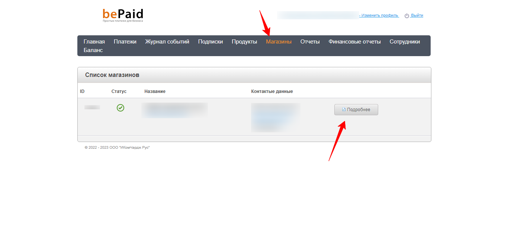

# Подключение bePaid.tech

Для подключения платежной системы вам потребуются ID магазина и секретный ключ.

<figure><figcaption></figcaption></figure>

<figure><figcaption></figcaption></figure>

Скопируйте ID магазина и Секретный ключ и добавьте интеграцию в аккаунте Квесча.

Далее вы должны настроить генерацию платежной ссылки в сценарии действий, а также принять платеж.

Для приема платежа установите галочку в отдельном блоке "Ожидание платежа" и, при необходимости, подключите к нему сценарий действий, где настройте действие "Платежи" -> "Принять платеж".

