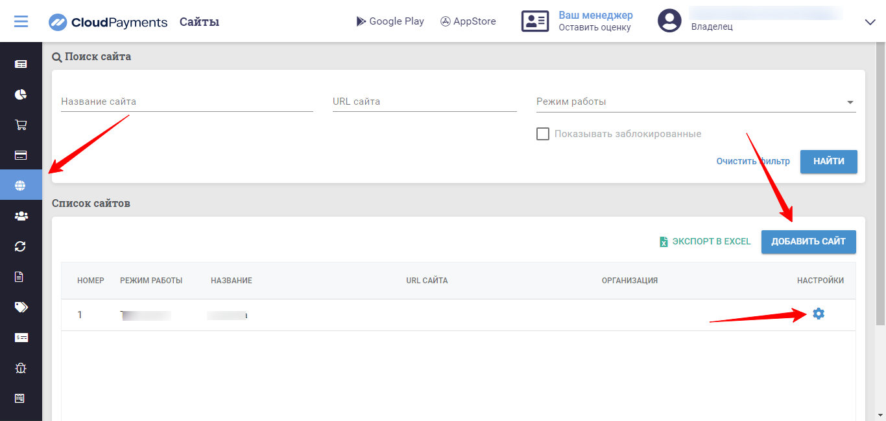
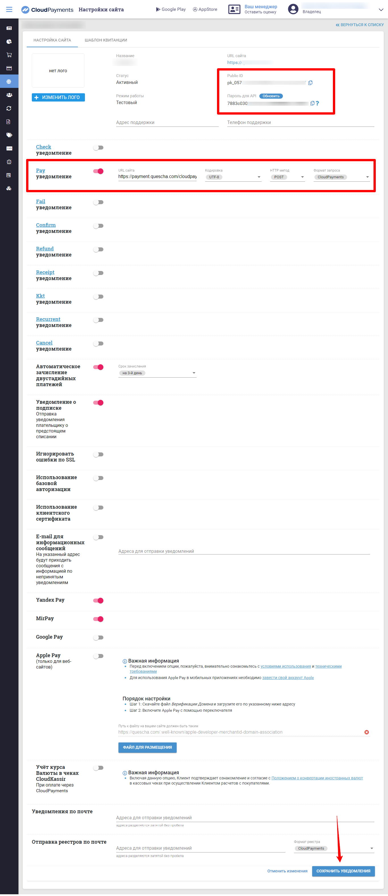

# Подключение CloudPayments.ru

Для подключения платежной системы вам потребуются Public ID и Пароль для API.

Добавьте сайт и перейдите в настройки.

<figure><figcaption></figcaption></figure>

Скопируйте данные и добавьте их в аккаунте Квесча.

<figure><figcaption></figcaption></figure>

Включите Pay уведомление и скопируйте в него адрес из окна интеграции в аккаунте Квесча.

Сохраните настройки сайта.

После добавления данных для интеграции в аккаунте Квесча нажмите Сохранить. Интеграция добавлена.

Далее вы должны настроить генерацию платежной ссылки в сценарии действий, а также принять платеж.

Для приема платежа установите галочку в отдельном блоке "Ожидание платежа" и, при необходимости, подключите к нему сценарий действий, где настройте действие "Платежи" -> "Принять платеж".

