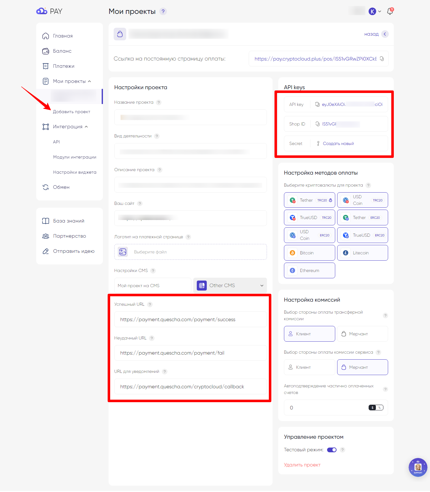

# Подключение CryptoCloud.plus

Для подключения платежной системы вам потребуются API key, Shop ID и Secret.

Добавьте проект и перейдите в настройки.

Скопируйте данные и добавьте их в аккаунте Квесча.

<figure><figcaption></figcaption></figure>

Скопируйте из окна добавления интеграции URL для уведомлений и вставьте в настройках проекта в аккаунте платежной системы. При необходимости укажите Успешный/Неуспешный URL.

Сохраните настройки проекта.

После добавления данных для интеграции в аккаунте Квесча нажмите Сохранить. Интеграция добавлена.

Далее вы должны настроить генерацию платежной ссылки в сценарии действий, а также принять платеж.

Для приема платежа установите галочку в отдельном блоке "Ожидание платежа" и, при необходимости, подключите к нему сценарий действий, где настройте действие "Платежи" -> "Принять платеж".

