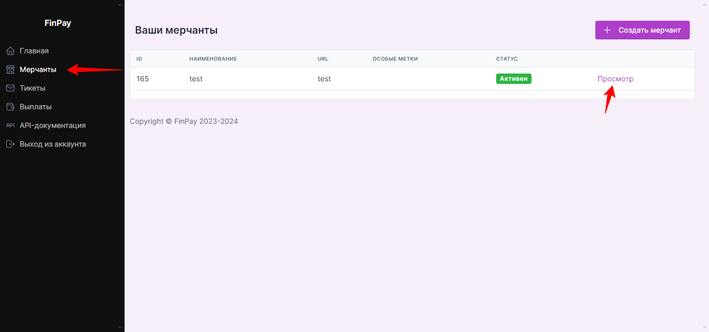

# Подключение FinPay

Для подключения платежной системы вам потребуются ID мерчанта, ключ №1 и ключ №2. Они находятся в аккаунте платежной системы.

<figure><figcaption></figcaption></figure>

<figure><figcaption></figcaption></figure>

Добавьте интеграцию в аккаунте Квесча.

Скопируйте и вставьте URL для уведомлений в аккаунте FinPay. При желании можете заполнить поля ссылок для успешной оплаты и ошибки платежа.

<figure><figcaption></figcaption></figure>

Далее вы должны настроить генерацию платежной ссылки в сценарии действий, а также принять платеж.

Для приема платежа установите галочку в отдельном блоке "Ожидание платежа" и, при необходимости, подключите к нему сценарий действий, где настройте действие "Платежи" -> "Принять платеж".

Чтобы принимать платежи с зарубежных карт, выставите значение валюты платежа EUR при генерации платежной ссылки.

<figure><figcaption></figcaption></figure>

