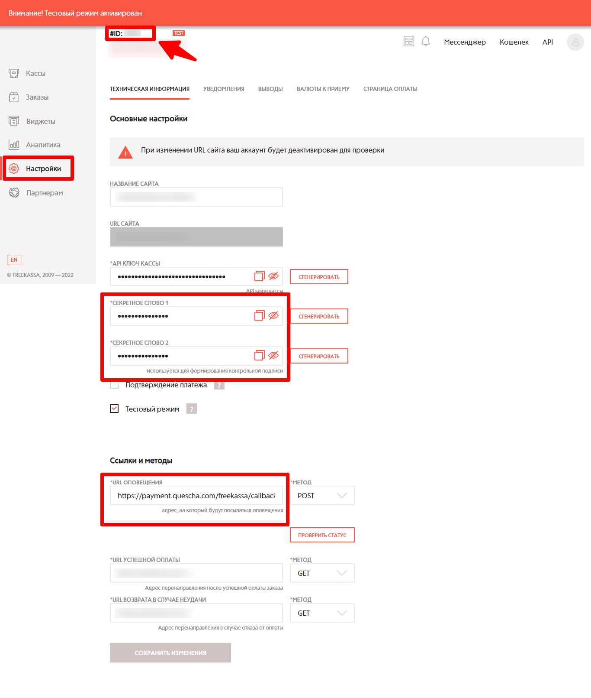

# Подключение Freekassa.ru

Чтобы подключить платежную систему вам потребуется знать ID кассы, секретное слово 1, секретное слово 2.

Перейдите на страницу настроек [https://merchant.freekassa.ru/settings](https://merchant.freekassa.ru/settings)

<figure><figcaption></figcaption></figure>

Добавьте платежную систему в аккаунт Квесча.

Далее вы должны настроить генерацию платежной ссылки в сценарии действий, а также принять платеж.

Для приема платежа установите галочку в сообщении "Ожидание платежа" и, при необходимости, подключите к нему сценарий действий, где настройте действие "Платежи" -> "Принять платеж".
