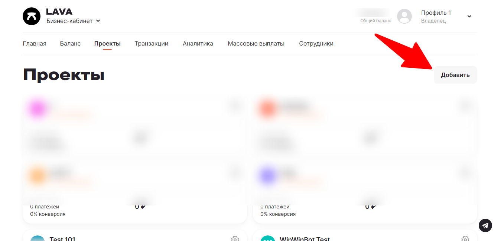

# Подключение LAVA.ru

Для подключения платежной системы вам потребуется ID проекта и Секретный ключ.

<figure><figcaption></figcaption></figure>

Создайте новый проект в аккаунте lava.ru и пройдите модерацию, чтобы вы смогли принимать платежи.

<figure><figcaption></figcaption></figure>

<figure><figcaption></figcaption></figure>

В настройках проекта скопируйте id проекта и секретный ключ и добавьте их в окне интеграции в конструкторе Квесча, нажмите сохранить.

Интеграция добавлена.

Далее вы должны настроить генерацию платежной ссылки в сценарии действий, а также принять платеж.

Для приема платежа установите галочку в отдельном блоке "Ожидание платежа" и, при необходимости, подключите к нему сценарий действий, где настройте действие "Платежи" -> "Принять платеж".


По вопросам модерации ваших чат-ботов при использовании в них платежной системы LAVA обращайтесь в [Телеграм](https://t.me/mihail_lava)

