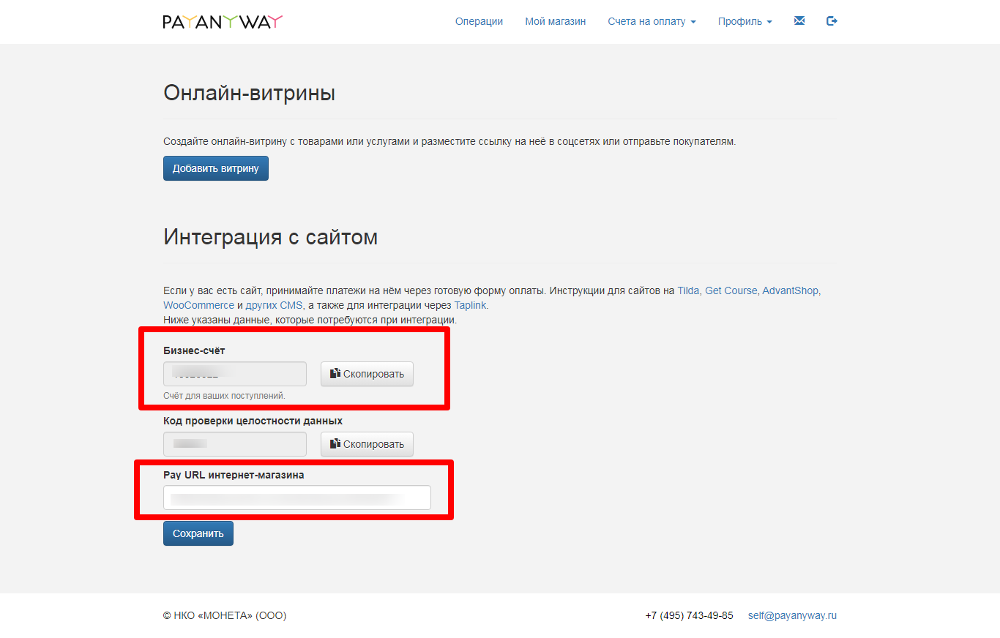

# Подключение PayAnyWay

Для подключения платежной системы вам потребуется номер бизнес-счета.

Переходим на страницу [https://self.payanyway.ru/index.php?show=instashop](https://self.payanyway.ru/index.php?show=instashop)

<figure><figcaption></figcaption></figure>

Сохраняем адрес для уведомлений [https://payment.quescha.com/payanyway/callback](https://payment.quescha.com/payanyway/callback)

Копируем номер бизнес-счета и добавляем интеграцию в аккаунте Квесча.

Далее вы должны настроить генерацию платежной ссылки в сценарии действий, а также принять платеж.

Для приема платежа установите галочку в сообщении "Ожидание платежа" и, при необходимости, подключите к нему сценарий действий, где настройте действие "Платежи" -> "Принять платеж".
