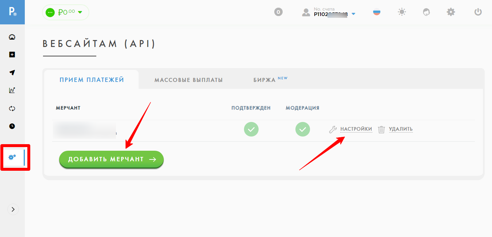

# Подключение Payeer.com

Для подключения платежной системы вам потребуются ID и Секретный ключ.

Добавьте мерчант и перейдите в настройки.

<figure><figcaption></figcaption></figure>

Скопируйте ID и секретный ключ и добавьте их в аккаунте Квесча.

<figure><figcaption></figcaption></figure>

Скопируйте из окна добавления интеграции URL обработчика и вставьте в настройках мерчанта в аккаунте платежной системы. При необходимости укажите URL успешной/неуспешной оплат.

Сохраните настройки мерчанта.

После добавления данных для интеграции в аккаунте Квесча нажмите Сохранить. Интеграция добавлена.

Далее вы должны настроить генерацию платежной ссылки в сценарии действий, а также принять платеж.

Для приема платежа установите галочку в отдельном блоке "Ожидание платежа" и, при необходимости, подключите к нему сценарий действий, где настройте действие "Платежи" -> "Принять платеж".

