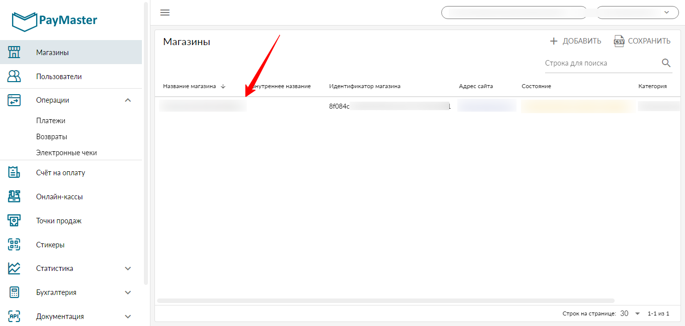

# Подключение PayMaster.ru

Для подключения платежной системы вам потребуются идентификатор магазина и API токен.

Добавьте магазин, если он еще не существует.

<figure><figcaption></figcaption></figure>

Перейдите в настройки магазина и скопируйте идентификатор магазина.

<figure><figcaption></figcaption></figure>

В настройках магазин перейдите на вкладку HTTP протокол и установить адрес для POST уведомлений.

<figure><figcaption></figcaption></figure>

Откройте меню справа сверху, добавьте и скопируйте API токен.

<figure><figcaption></figcaption></figure>

Сохраните интеграцию в аккаунте Квесча.

Далее вы должны настроить генерацию платежной ссылки в сценарии действий, а также принять платеж.

Для приема платежа установите галочку в отдельном блоке "Ожидание платежа" и, при необходимости, подключите к нему сценарий действий, где настройте действие "Платежи" -> "Принять платеж".

