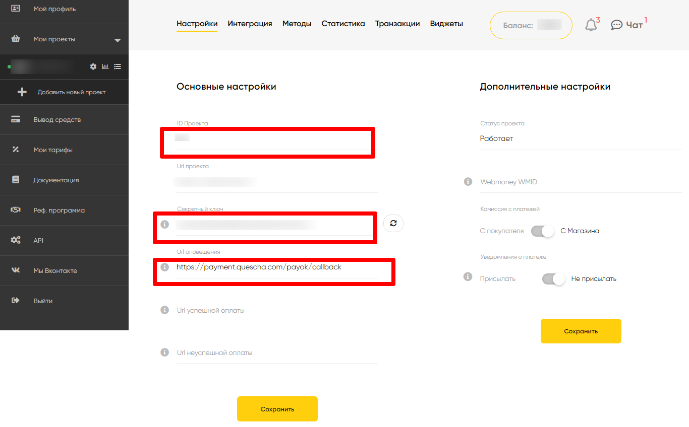

# Подключение Payok

Чтобы подключить платежную систему вам потребуется знать ID проекта и секретный ключ. И вы сможете получить в настройках проекта в аккаунте платежной системы. Там же вы сможете вставить адрес для уведомлений.

<figure><figcaption></figcaption></figure>

Добавьте платежную систему в аккаунт Квесча.

Далее вы должны настроить генерацию платежной ссылки в сценарии действий, а также принять платеж.

Для приема платежа установите галочку в сообщении "Ожидание платежа" и, при необходимости, подключите к нему сценарий действий, где настройте действие "Платежи" -> "Принять платеж".
