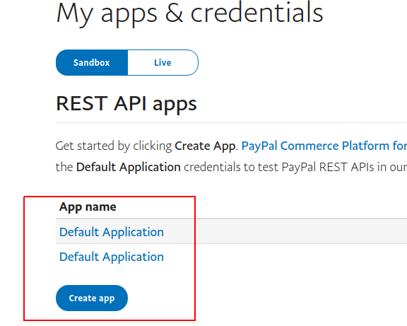
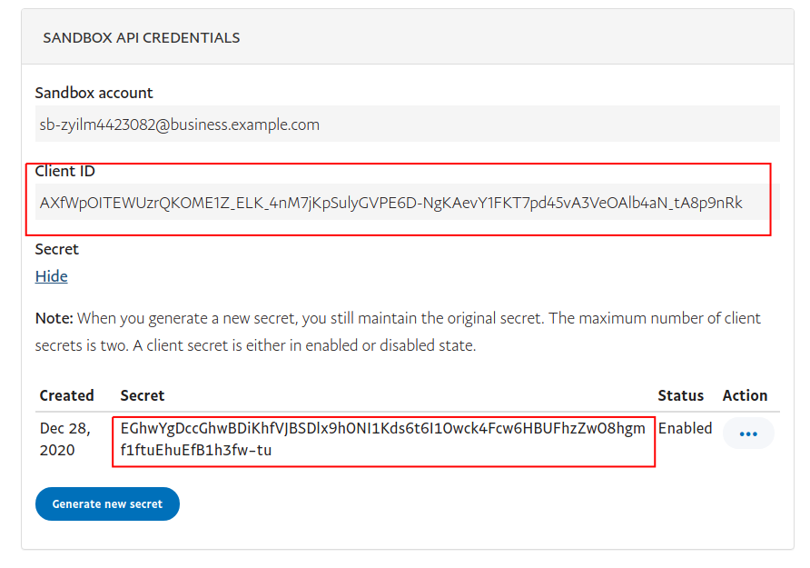

# Подключение PayPal

Для подключения платежной системы вам потребуется Client ID и Secret.

Переходим на страницу [https://developer.paypal.com/developer/applications/](https://developer.paypal.com/developer/applications/)

Выбираем из списка или создаем новое приложение

<figure><figcaption></figcaption></figure>

Вверху меняем переключатель в Live режим и выбираем нужное приложение. Открывается страница с настройками, где находятся нужные нам данные

<figure><figcaption></figcaption></figure>

Копируем Client ID и Secret и добавляем интеграцию в аккаунте Квесча.

Далее вы должны настроить генерацию платежной ссылки в сценарии действий, а также принять платеж.

Для приема платежа установите галочку в сообщении "Ожидание платежа" и, при необходимости, подключите к нему сценарий действий, где настройте действие "Платежи" -> "Принять платеж".

