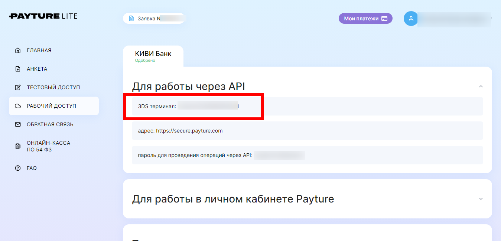

# Подключение Payture.com

Для подключения платежной системы вам потребуются идентификатор мерчанта из области "Для работы через API".

<figure><figcaption></figcaption></figure>

Скопируйте идентификатор мерчанта и сохраните интеграцию в аккаунте Квесча.

Отправьте письмо в поддержку по адресу support@payture.com с просьбой установить URL для нотификаций [https://payment.quescha.com/payture/callback](https://payment.quescha.com/payture/callback). Подробнее с требованиями к письму вы можете ознакомиться в документации сервиса [https://payture.com/api/#notifications\_](https://payture.com/api/#notifications_)

Письмо может выглядеть следующим образом:

> Добрый день, прошу установить URL для нотификаций в моем терминале.
>
> Логин: \[mylogin]
>
> ИНН: \[myinn]\
> URL нотификаций: [https://payment.quescha.com/payture/callback](https://payment.quescha.com/payture/callback)
>
> Метод: POST
>
> Операции:
>
> [api/Pay](https://payture.com/api/#payture-api_pay_)
>
> [apim/Pay](https://payture.com/api/#inpay_pay_)\
> [vwapi/Pay](https://payture.com/api/#ewallet_pay_payture-side_)

Далее вы должны настроить генерацию платежной ссылки в сценарии действий, а также принять платеж.

Для приема платежа установите галочку в отдельном блоке "Ожидание платежа" и, при необходимости, подключите к нему сценарий действий, где настройте действие "Платежи" -> "Принять платеж".

