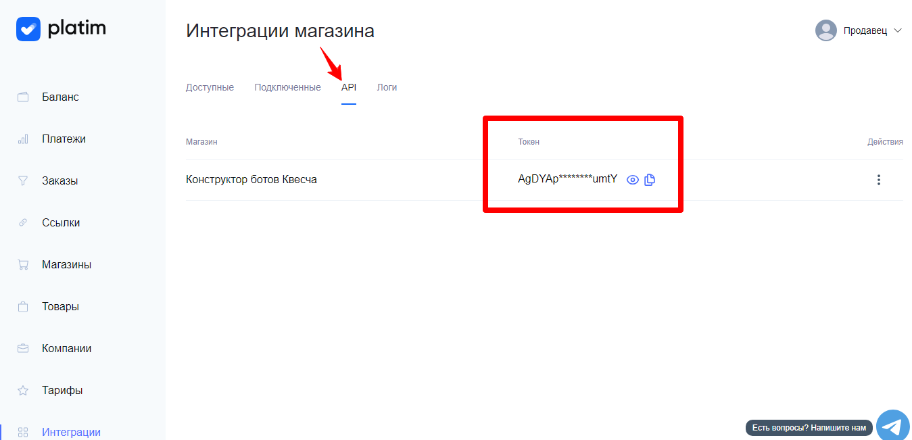

# Подключение Platim.ru

Для подключения платежной системы вам потребуются токен.

Добавьте магазин, если он еще не существует.

<figure><figcaption></figcaption></figure>

Перейдите в настройки магазина, скопируйте токен и добавьте в окне интеграции конструктора.

<figure><figcaption></figcaption></figure>

Сохраните интеграцию.

Далее вы должны настроить генерацию платежной ссылки в сценарии действий, а также принять платеж.

Для приема платежа установите галочку в отдельном блоке "Ожидание платежа" и, при необходимости, подключите к нему сценарий действий, где настройте действие "Платежи" -> "Принять платеж".

