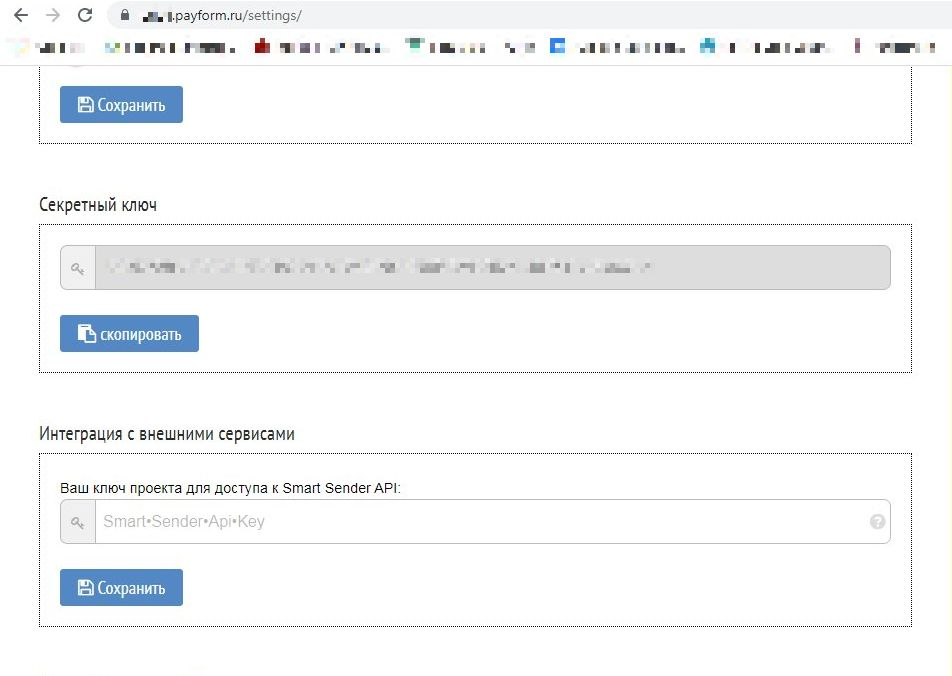
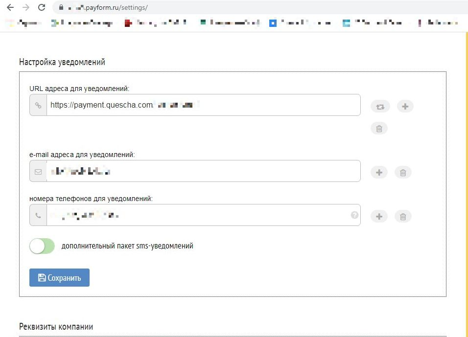

# Подключение Prodamus

Для подключения вам потребуются поддомен аккаунта и секретный ключ.

Перейдите в настройки своего платежного аккаунта и установите адрес для уведомлений. Там же находится секретный ключ.

<figure><figcaption></figcaption></figure> <figure><figcaption></figcaption></figure>

Добавьте платежную систему в аккаунт Квесча.

Далее вы должны настроить генерацию платежной ссылки в сценарии действий, а также принять платеж.

Для приема платежа установите галочку в сообщении "Ожидание платежа" и, при необходимости, подключите к нему сценарий действий, где настройте действие "Платежи" -> "Принять платеж".
