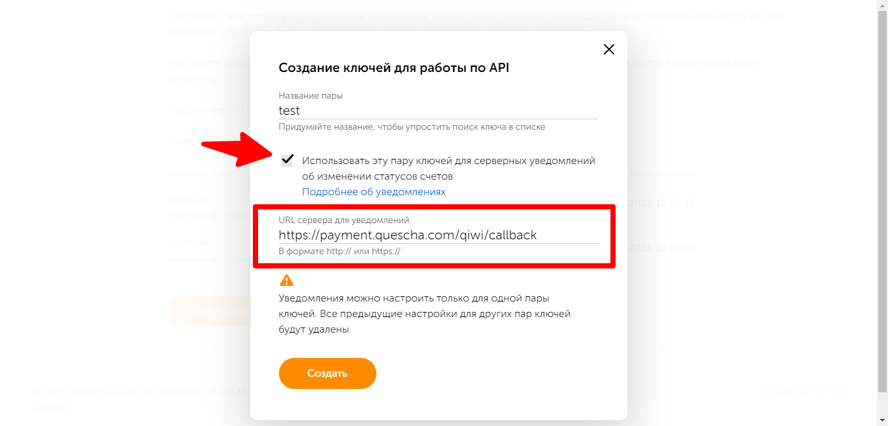
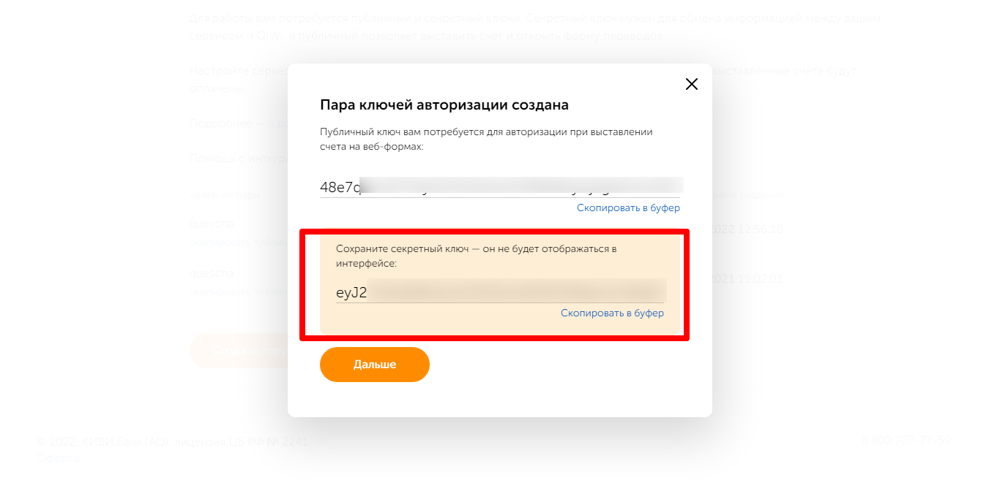

# Подключение Qiwi

Чтобы подключить платежную систему вам потребуется секретный ключ. Перейдите на страницу [https://qiwi.com/p2p-admin/transfers/api](https://qiwi.com/p2p-admin/transfers/api)

Нажмите "Создать пару ключей и настроить", введите название, поставьте галочку

<figure><figcaption></figcaption></figure>

Далее скопируйте секретный ключ и добавьте интеграцию в аккаунте Квесча.

<figure><figcaption></figcaption></figure>

Далее вы должны настроить генерацию платежной ссылки в сценарии действий, а также принять платеж.

Для приема платежа установите галочку в сообщении "Ожидание платежа" и, при необходимости, подключите к нему сценарий действий, где настройте действие "Платежи" -> "Принять платеж".
