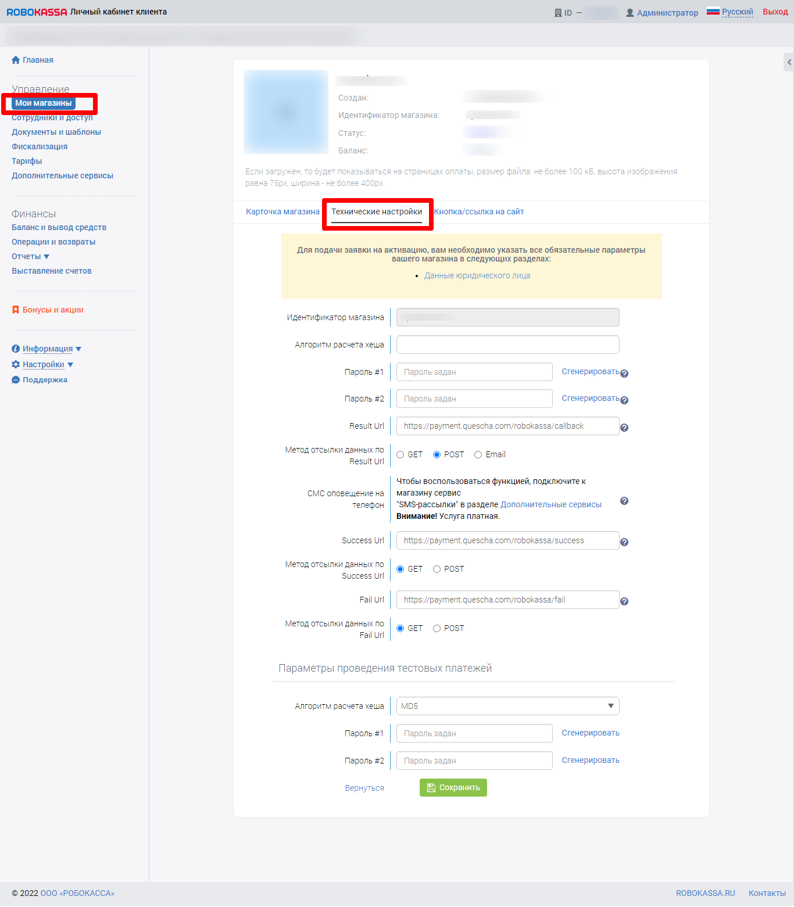

# Подключение Robokassa

Для подключения вам потребуются Идентификатор магазина, Пароль 1, Пароль 2.

Все данные находятся в технических настройках вашего магазина.

<figure><figcaption></figcaption></figure>

Установите в аккаунте платежной системы необходимые адреса для уведомлений.

Добавьте платежную систему в аккаунт Квесча.

Далее вы должны настроить генерацию платежной ссылки в сценарии действий, а также принять платеж.

Для приема платежа установите галочку в сообщении "Ожидание платежа" и, при необходимости, подключите к нему сценарий действий, где настройте действие "Платежи" -> "Принять платеж".
