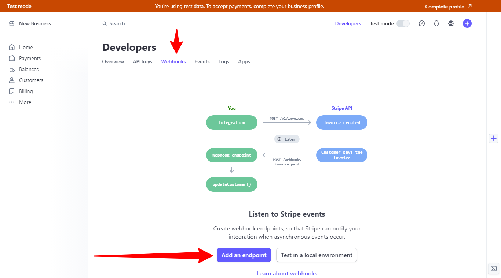
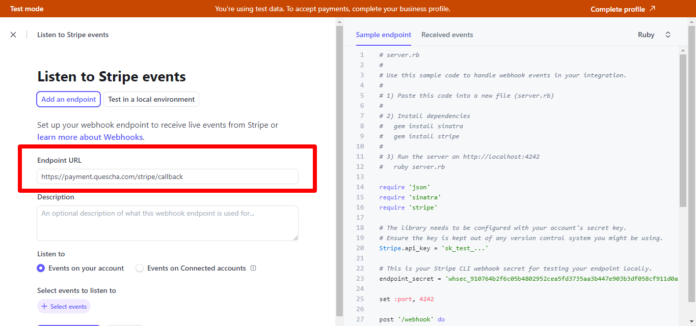

# Подключение Stripe

Для подключения платежной системы вам потребуются Publishable key и Secret key. Они находятся в аккаунте платежной системы.

<figure><figcaption></figcaption></figure>

Добавьте интеграцию в аккаунте Квесча.

Скопируйте и вставьте URL для уведомлений и установите их в аккаунте Stripe. Для этого перейдите на страницу для разработчиков (Developers), нажмите на Add an endpoint на вкладке Webhooks.

<figure><figcaption></figcaption></figure>

<figure><figcaption></figcaption></figure>

Вставьте URL для уведомлений конструктора.

<figure><figcaption></figcaption></figure>

Выберите событие checkout.session.completed и сохраните настройки.

<figure><figcaption></figcaption></figure>

Далее вы должны настроить генерацию платежной ссылки в сценарии действий, а также принять платеж.

Для приема платежа установите галочку в отдельном блоке "Ожидание платежа" и, при необходимости, подключите к нему сценарий действий, где настройте действие "Платежи" -> "Принять платеж".
