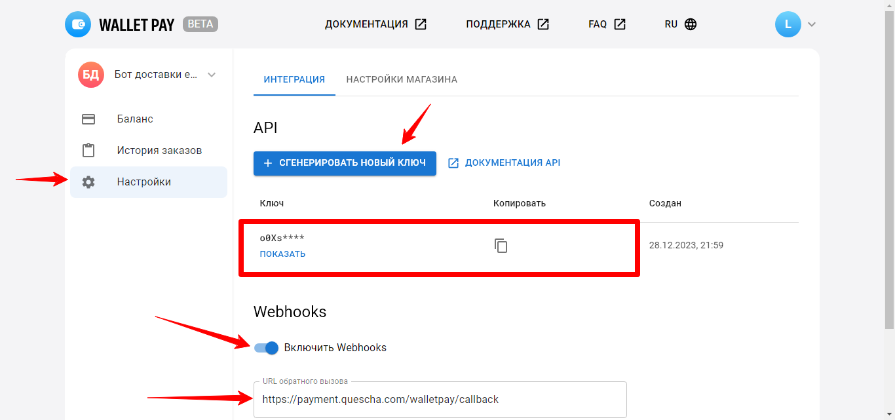

# Подключение Telegram Wallet Pay

Для подключения платежной системы вам потребуются API ключ для вашего бота.

<figure><figcaption></figcaption></figure>

Создайте API ключ и добавьте интеграцию в аккаунте Квесча.

Скопируйте и вставьте URL для уведомлений в аккаунте Telegram Wallet Pay, включив настройку Webhooks.

Далее вы должны настроить генерацию платежной ссылки в сценарии действий, а также принять платеж.

Для приема платежа установите галочку в отдельном блоке "Ожидание платежа" и, при необходимости, подключите к нему сценарий действий, где настройте действие "Платежи" -> "Принять платеж".

