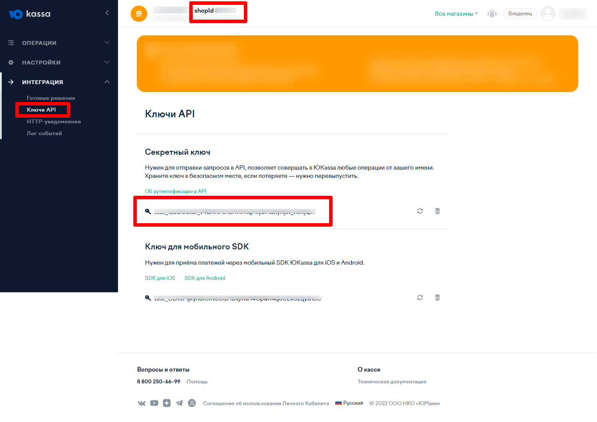
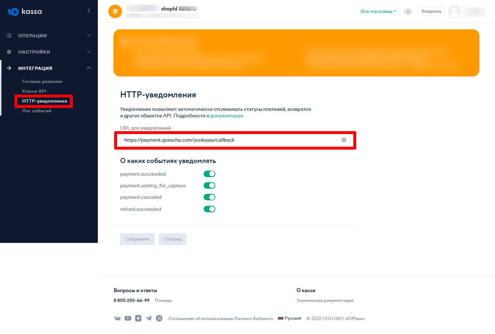

# Подключение YooKassa

Чтобы подключить обработку платежей YooKassa вам потребуется Shop ID и Secret Key, а также установить адрес http уведомлений [https://payment.quescha.com/yookassa/callback](https://payment.quescha.com/yookassa/callback)

Перейдите на страницу [https://yookassa.ru/my/merchant/integration/api-keys](https://yookassa.ru/my/merchant/integration/api-keys)

Здесь находятся Shop ID и Secret Key, которые необходимо указать при добавлении платежной системы в аккаунте Квесчи

<figure><figcaption></figcaption></figure>

Далее перейдите на страницу [https://yookassa.ru/my/merchant/integration/http-notifications](https://yookassa.ru/my/merchant/integration/http-notifications)

Здесь вы должны установить адрес для уведомлений [https://payment.quescha.com/yookassa/callback](https://payment.quescha.com/yookassa/callback)

<figure><figcaption></figcaption></figure>

Сохраните настройки. Подключение завершено.

Далее вы должны настроить генерацию платежной ссылки в сценарии действий, а также принять платеж.

Для приема платежа установите галочку в сообщении "Ожидание платежа" и, при необходимости, подключите к нему сценарий действий, где настройте действие "Платежи" -> "Принять платеж".
