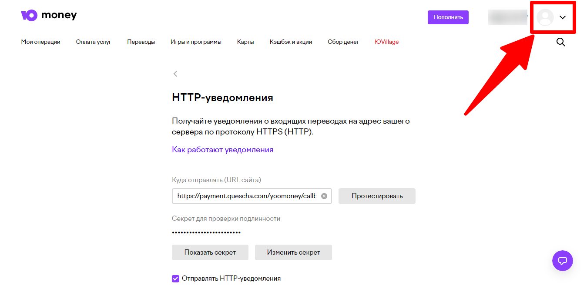
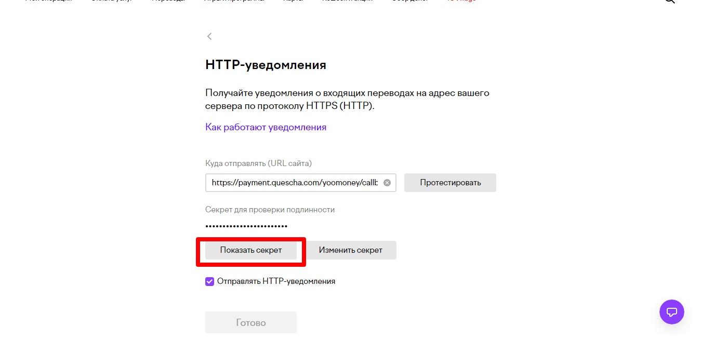
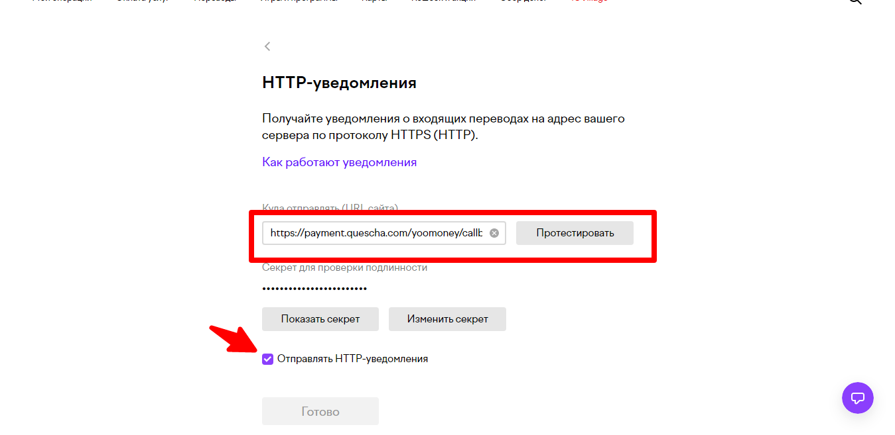

# Подключение YooMoney

Чтобы подключить обработку платежей YooMoney вам потребуется номер кошелька и секретный ключ, а также установить адрес http уведомлений [https://payment.quescha.com/yoomoney/callback](https://payment.quescha.com/yoomoney/callback)

Перейдите на страницу [https://yoomoney.ru/transfer/myservices/http-notification](https://yoomoney.ru/transfer/myservices/http-notification)

Номер кошелька вы можете увидеть, нажав на меню в правом верхнем углу

<figure><figcaption></figcaption></figure>

<figure><figcaption></figcaption></figure>

Далее скопируйте секрет и сохраните настройки платежной системы в аккаунте Квесчи.

<figure><figcaption></figcaption></figure>

Установите адрес для уведомлений в аккаунте платежной системы, установите галочку "Отправлять HTTP-уведомления и нажмите готово.

<figure><figcaption></figcaption></figure>

Подключение завершено.

Далее вы должны настроить генерацию платежной ссылки в сценарии действий, а также принять платеж.

Для приема платежа установите галочку в сообщении "Ожидание платежа" и, при необходимости, подключите к нему сценарий действий, где настройте действие "Платежи" -> "Принять платеж".
