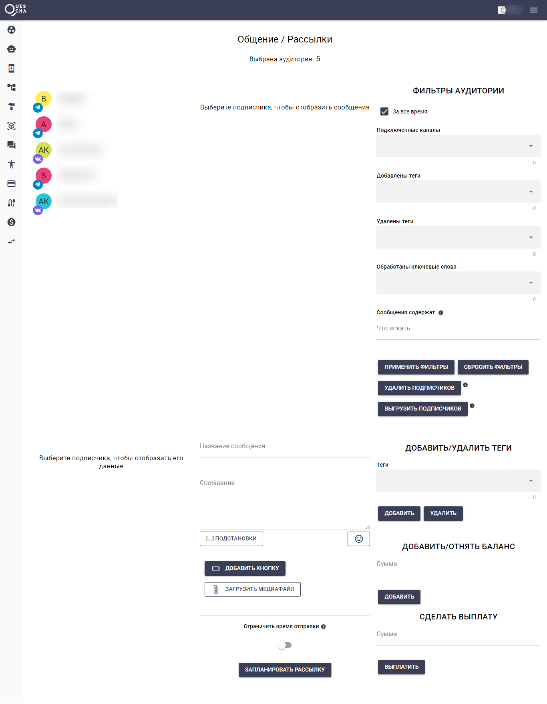

# Подписчики/Рассылки

<figure><figcaption></figcaption></figure>

На этой странице находится база подписчиков, собранная в мессенджерах. Вы можете фильтровать базу по множеству параметров, писать сообщения и делать рассылки. При необходимости можете выгрузить базу или удалить подписчиков полностью или частично.

Сортируется список по дате последнего действия подписчика.

По умолчанию выводится весь список.

При нажатии на подписчика, подгружается переписка и данные подписчика. По центру отображается история сообщений подписчика. Справа располагаются настройки фильтра базы подписчиков. Чтобы увидеть все настройки, необходимо прокрутить этот блок вниз.

Во втором ряду слева находятся детальная информация выбранного подписчика. Здесь можно оставить заметку.

Во втором ряду по центру находится окно отправки сообщения по выбранной базе.

Во втором ряду справа вы можете добавлять/удалять тегу и подписчиков, добавлять/отнимать баланс и делать выплаты во встроенной реферальной системе конструктора.

Если выбран один подписчик, то сообщение ему будет отправлено сразу.

Если подписчиков много, то отправка будет запланирована, а сообщение будет сохранено ниже.
