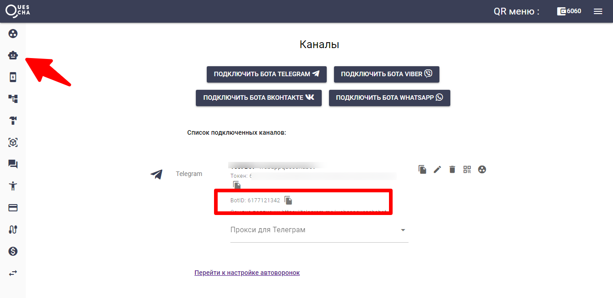

# Привязка сотрудников (Отправка заявок)

Вы можете привязать менеджеров для получения ими лидов из автоворонки. Все, что нужно сделать, это создать нового сотрудника и ввести код активации в любом добавленном в конструктор боте. Далее вы можете отправлять заявки в блоках и сценариях действий на любом шаге автоворонки.



#### Отправка сотруднику из блока

<figure><figcaption></figcaption></figure>

#### Отправка сотруднику из сценария действий

<figure><figcaption></figcaption></figure>

### Способ 2: Отправка в бот данных с кнопками и медиафайлами на любом шаге сценария

Если вы хотите отправлять любые данные, то используйте для этого сценарии действий и "отправку в бот".

Для отправки вам необходимо знать ID бота, в который вы будете отправлять данные, ID клиента/подписчика/администратора, т.е. того, кто получит данные, и тип мессенджера в который отправляются данные.



Добавьте бота для получения заявок на странице Каналы и скопируйте BotID канала

<figure><figcaption></figcaption></figure>

Администратор должен запустить этот бот, чтобы он мог принимать сообщение. После этого перейдите на страницу Общение/Рассылки нажмите на администратора в списке и скопируйте его ClientID

<figure><figcaption></figcaption></figure>

В сценарии действий отметьте Отправка в бот и заполните данные для отправки и текст отправляемого сообщения. Привяжите сценарий действий к блоку, где будет происходить отправка.

<figure><figcaption></figcaption></figure>


В тексте сообщения вы можете использовать текст, переменные и шаблоны. Используйте Подстановки для выбора шаблонов.


Протестируйте отправку.

