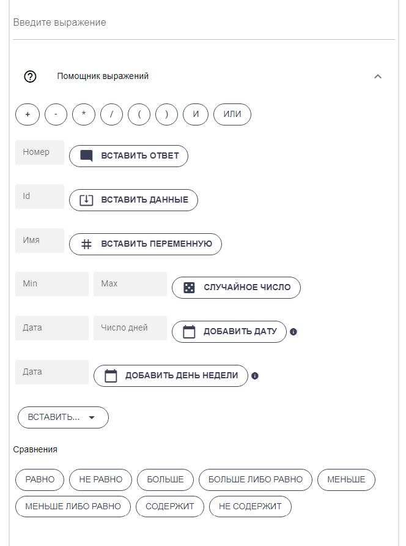

# Сценарии действий

Сценарии дают большой дополнительный функционал для автоворонок и, также, могут быть использованы для приема вебхука от какого-либо сервера, crm. Обработка перехода по ссылке также выполняется сценарием действий.

С чем возможно работать во сценариях действий:

* Операции с данными (переменные, списки, глобальные переменные)
* Платежи
* CRM
* Google Таблицы
* Обмен данными (запросы к внешним API, прием вебхуков)
* Ссылки
* Прием и пересылка медиа (от подписчиков в мессенджер)
* Генерация документа из шаблона
* Работа с группами и каналами в Telegram
* Проверка тегов
* Нейросеть
* Web App Телеграм
* JS код
* Google Календарь
* Google Диск
* Яндекс Диск
* Реферальная система в Telegram



Чтобы отобразить сообщение, возвращаемое сценарием действий, используйте шаблон \[Actions] (или \[External]) в сценарном сообщении.

<figure><figcaption></figcaption></figure>



Результат работы чат-бота на бот-лендинге



Активно используйте "Помощник выражений" для работы и манипулирования данными.

Полный актуальный список всех шаблонов и функций можно посмотреть [здесь](../start/shablony-i-funkcii.md).

Сценарий действий можно подключить до и после отправки сообщения. Если сценарий действий подключен до отправки сообщения, то возвращаемое сообщение из сценария действий заменит шаблон \[Actions] в сценарном сообщении.

Подключение сценария действий до отправки сообщения:

.png>)

Подключение сценария действий после отправки сообщения:

.png>)

Теперь стало возможным настраивать действия прямо в визуальном редакторе!

<figure><figcaption></figcaption></figure>

<figure><figcaption></figcaption></figure>

Таким образом, вам не придется переходить на специальную страницу для настройки действий. Это значительно ускорит настройку ваших чат-ботов!


При настройке сценария действий учитывайте ограничение в 100 переходов от действия к действию

