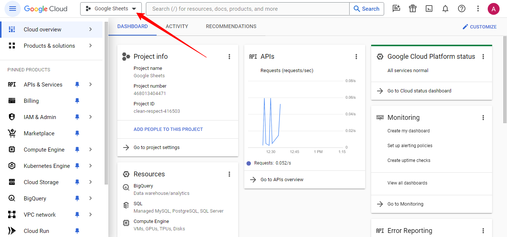
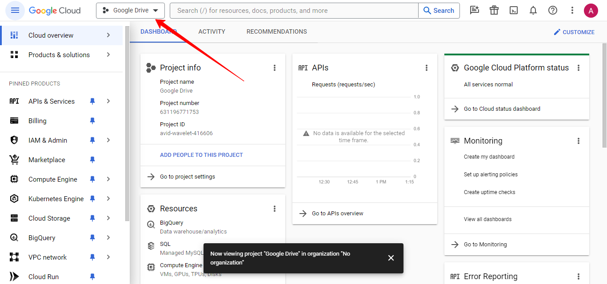
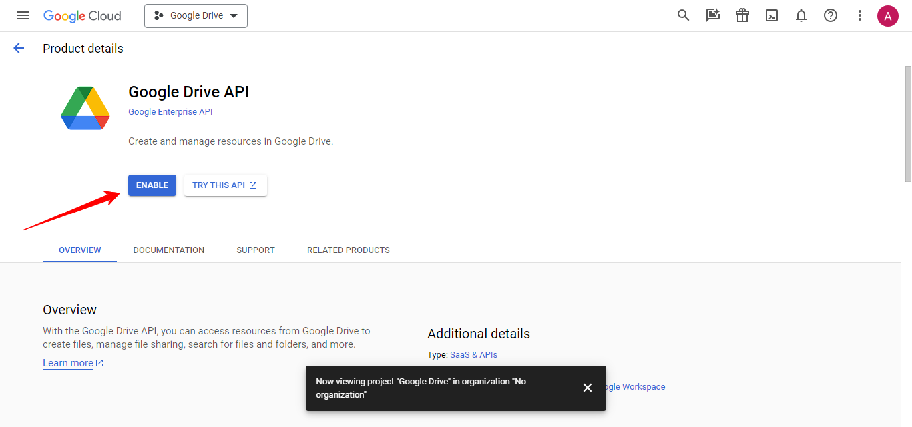
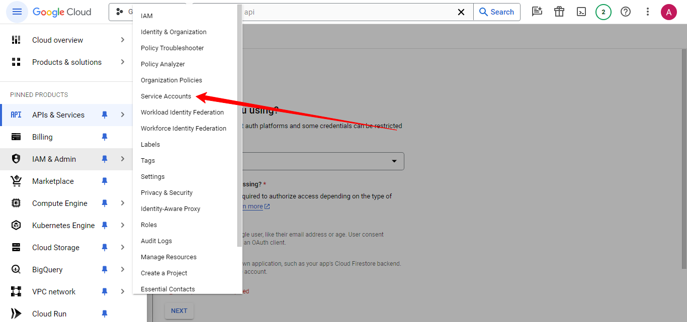
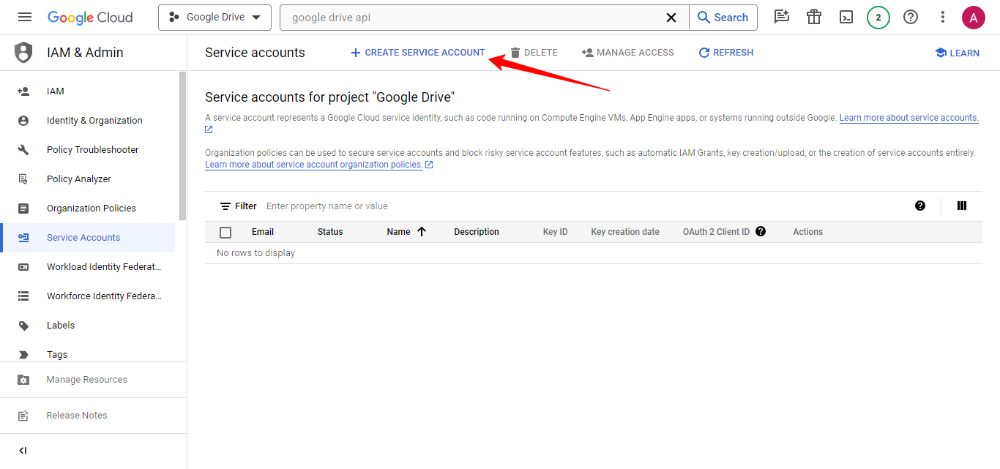
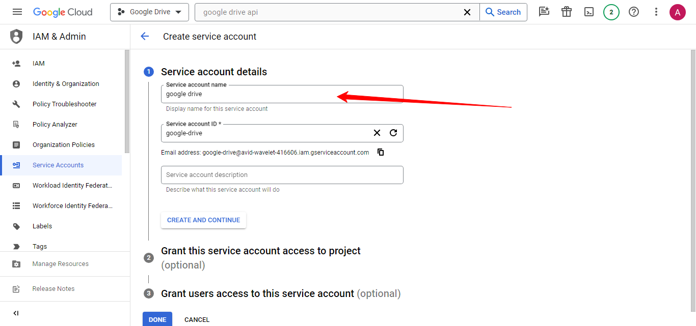
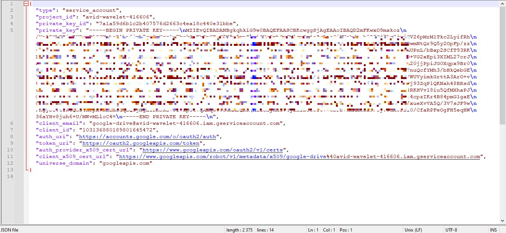

# Google Диск (Устар. сервисный аккаунт)

Конструктор позволяет загружать файлы на Гугл Диск, получить ссылку на файл. Также можно удалять загруженные ранее файлы.

Чтобы иметь возможность работать с Гугл Диском, вам потребуется сервисный аккаунт Гугл. Давайте создадим его.

Перейдите по ссылке [https://console.cloud.google.com/](https://console.cloud.google.com/)

<figure><figcaption></figcaption></figure>

Создадим новый проект. Если у вас уже есть сервисный аккаунт, то вы можете добавить туда поддержку Google Drive API через поиск вверху и включить его.

<figure><figcaption></figcaption></figure>

<figure><figcaption></figcaption></figure>

Выберем созданный проект.

<figure><figcaption></figcaption></figure>

<figure><figcaption></figcaption></figure>

В поле поиска вверху вводим google drive api и выбираем его из списка.

<figure><figcaption></figcaption></figure>

Включаем Google Drive API, нажав ENABLE.

<figure><figcaption></figcaption></figure>

Теперь мы должны создать ключи доступа для сервисного аккаунта. Для этого переходим в меню Service Accounts.

<figure><figcaption></figcaption></figure>

Нажимаем CREATE SERVICE ACCOUNT.

<figure><figcaption></figcaption></figure>

Вводим название и нажимаем CREATE AND CONTINUE.

<figure><figcaption></figcaption></figure>

Выбираем роль сервисного аккаунта Owner. Нажимаем CONTINUE.

<figure><figcaption></figcaption></figure>

Нажимаем DONE.

<figure><figcaption></figcaption></figure>

Открываем настройки сервисного аккаунта, нажав на емэйл.

<figure><figcaption></figcaption></figure>

Переходим на вкладку KEYS и в выпадающем меню ADD KEY нажимаем Create new key.

<figure><figcaption></figcaption></figure>

Тип создаваемых ключей оставляем JSON.

<figure><figcaption></figcaption></figure>

Нажимаем CREATE.

<figure><figcaption></figcaption></figure>

Json файл сохранится на ваш компьютер.

<figure><figcaption></figcaption></figure>

Откройте файл с ключами с помощью текстового редактора, выделите все и скопируйте содержимое в буфер обмена.

<figure><figcaption></figcaption></figure>

Теперь вы можете использовать этот сервисный аккаунт в конструкторе. Добавьте действие Google Диск  и вставьте содержимое JSON файла в поле Сервисный аккаунт. Также заполните поля с названием файла и ссылкой на сохраняемый файл. Ссылку на файл можно принимать при пересылке файлов от пользователя в боте. При использовании действия Прием и пересылка файлов, URL файла сохраняется в переменную #{media\_url}.

Также укажите названия для переменных, в которые будет сохранен URL файла Гугл Диска и ID файла.

Дополнительно можете указать переменные об успехе операции и JSON ответа сервера.

<figure><figcaption></figcaption></figure>

После создания файла в Гугл Диске вы получаете ссылку на файл, которая доступна для чтения для всех открывших ее. Также вы можете указать емэйл Гугл Аккаунта, для которого будут назначены права редактора и этот файл будет отображен в Гугл Диске этого аккаунта на странице Доступные мне.

<figure><figcaption></figcaption></figure>
