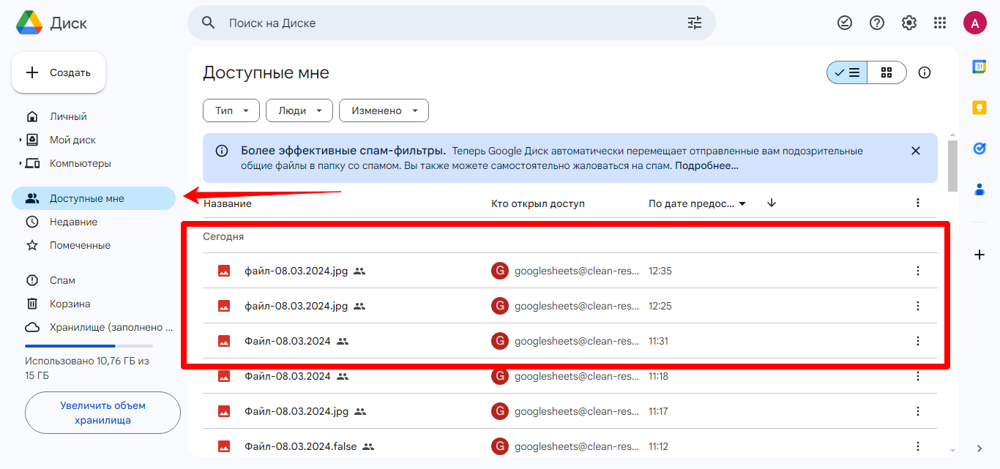

# Google Диск

Конструктор позволяет загружать файлы на Гугл Диск, получить ссылку на файл. Также можно удалять загруженные ранее файлы.

Чтобы иметь возможность работать с Гугл Диском, вам потребуется подключить Гугл Аккаунт на странице интеграций [https://app.quescha.com/autofunnels/integrations](https://app.quescha.com/autofunnels/integrations).

После подключения вы можете использовать его в сценарии действий. Добавьте действие Google Диск  и укажите созданный Гугл Аккаунт. Также заполните поля с названием файла и ссылкой на сохраняемый файл. Ссылку на файл можно принимать при пересылке файлов от пользователя в боте. При использовании действия Прием и пересылка файлов, URL файла сохраняется в переменную #{media\_url}.

Также укажите названия для переменных, в которые будет сохранен URL файла Гугл Диска и ID файла.

Дополнительно можете указать переменные об успехе операции и JSON ответа сервера.

<figure><figcaption></figcaption></figure>


Обратите внимание, что на скриншоте отображен сервисный аккаунт, который для Гугл Диска больше не используется. Вместо сервисного аккаунта, необходимо добавить Гугл Аккаунт на странице интеграций [https://app.quescha.com/autofunnels/integrations](https://app.quescha.com/autofunnels/integrations)


После создания файла в Гугл Диске вы получаете ссылку на файл, которая доступна для чтения для всех открывших ее. Также вы можете указать емэйл Гугл Аккаунта, для которого будут назначены права редактора и этот файл будет отображен в Гугл Диске этого аккаунта на странице Доступные мне.

<figure><figcaption></figcaption></figure>


В случае необходимости, например, если вы не отметили нужные галочки для доступа, удалите интеграцию из аккаунта Квесчи и приложение Quescha на странице [https://myaccount.google.com/permissions](https://myaccount.google.com/permissions). Добавьте интеграцию в аккаунт Квесчи заново

