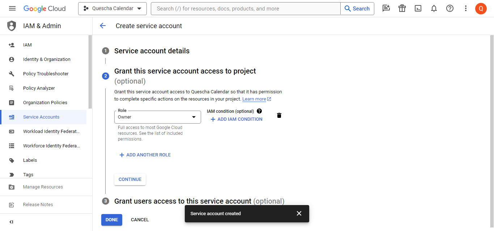
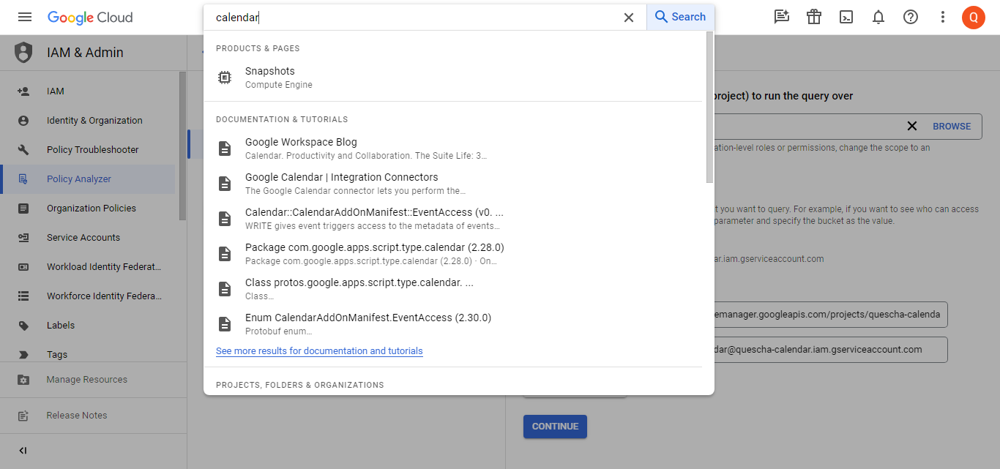
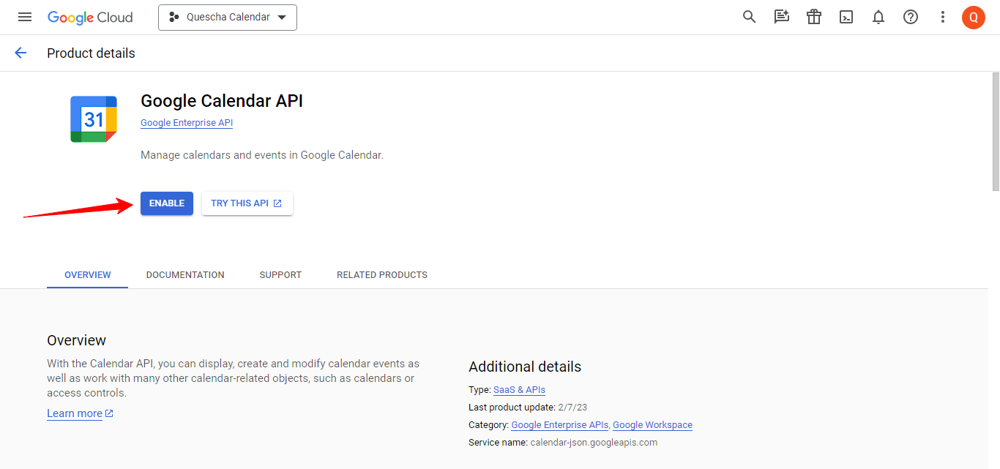
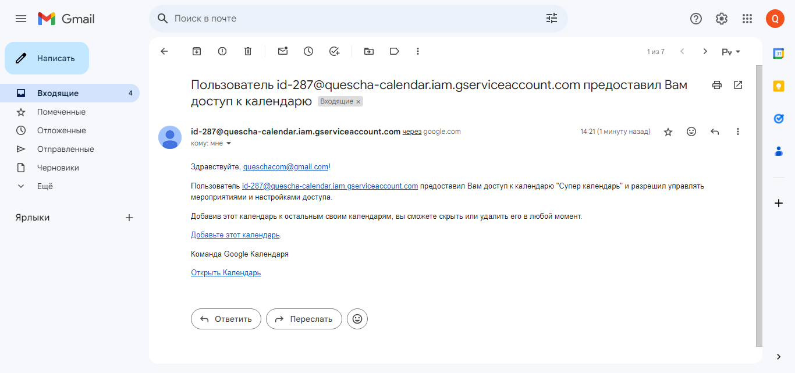
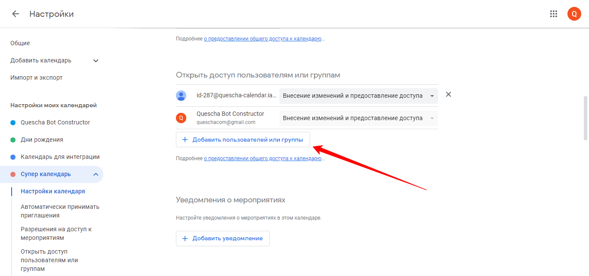

# Google Календарь

Интеграция с Гугл календарем позволит вам управлять календарями и создаваемыми в них событиями. Также вы сможете проверять занятость определенных дат и времени в календаре.

Вам потребуется **сервисный гугл аккаунт.**

Перейдите на страницу [https://console.developers.google.com/iam-admin/serviceaccounts?hl=ru](https://console.developers.google.com/iam-admin/serviceaccounts?hl=ru) и нажмите кнопку Create Project.

<figure><figcaption></figcaption></figure>

После этого нажмите кнопку Create Service Account

<figure><figcaption></figcaption></figure>

При создании, предоставьте сервисному аккаунту права владельца.

<figure><figcaption></figcaption></figure>

После создания нажмите на емэйл сервисного аккаунта, чтобы открыть настройки

<figure><figcaption></figcaption></figure>

Перейдите на вкладку KEYS и создайте JSON файл с ключами

<figure><figcaption></figcaption></figure>

<figure><figcaption></figcaption></figure>

<figure><figcaption></figcaption></figure>

<figure><figcaption></figcaption></figure>

Теперь необходимо включить доступ к API Гугл Календаря для этого сервисного аккаунта.

Введите в поле поиска calendar  и найдите Google Calendar API

<figure><figcaption></figcaption></figure>

<figure><figcaption></figcaption></figure>

Включите доступ, нажав на кнопку Enable

<figure><figcaption></figcaption></figure>

Теперь, чтобы использовать интеграцию в сценарии действий выберите Google Календарь.

В поле для сервисного аккаунта откройте файл с ключами в текстовом редакторе, скопируйте содержимое и вставьте.

<figure><figcaption></figcaption></figure>

Все календари создаются в сервисном аккаунте. При создании, вы можете указать вашу почту от гугл аккаунта, чтобы была возможность управлять этим календарем вручную. При этом на вашу почту придет письмо для подтверждения.

<figure><figcaption></figcaption></figure>

Для получения доступа к существующим календарям, укажите в его настройках емэйл от сервисного аккаунта.

<figure><figcaption></figcaption></figure>

ID существующих в других аккаунтах календарей вы также можете найти в их настройках.

<figure><figcaption></figcaption></figure>


Для некоторых операций вам не будет требоваться сохранения сценария действий для бота и вы можете выполнять их из аккаунта конструктора нажав кнопку "Выполнить сейчас" в операциях сценария действий Google Календарь. Это может быть операция по созданию календарей или его удаления, получения списка и т.п.

