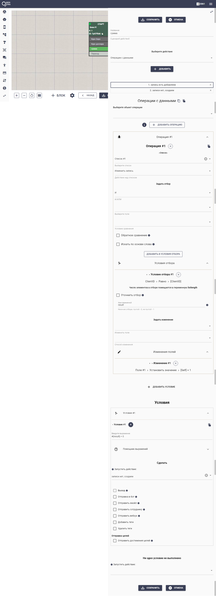
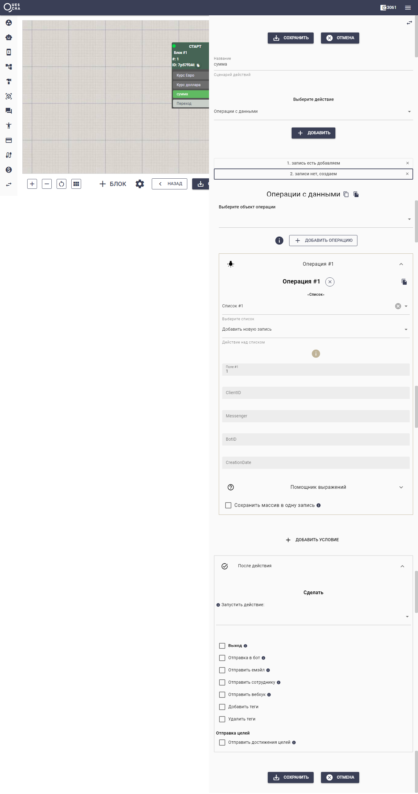

# Изменить или создать запись

Например, у нас есть задача при каждом запуске блока увеличивать значение Поля #1 на единицу. При первом обращении запись в списке еще не создана и нам нужно ее создать, а при последующих создавать уже не требуется и нужно изменять ее. Как понять когда создавать, а когда изменять?

Покажем хорошую практику решения этой задачи.

С помощью двух действий мы будем сначала пытаться изменять запись в списке, а в случае отсутствия записи - создавать запись по-умолчанию.

Действие по изменению записи.

<figure><figcaption></figcaption></figure>

Первым действием мы изменяем запись и записываем в переменную result успешность этой операции.

После этого, через условие невыполненной операции (#{result} = 0) мы запускаем действие добавления в список записи по-умолчанию.

Действие по созданию новой записи.

<figure><figcaption></figcaption></figure>
