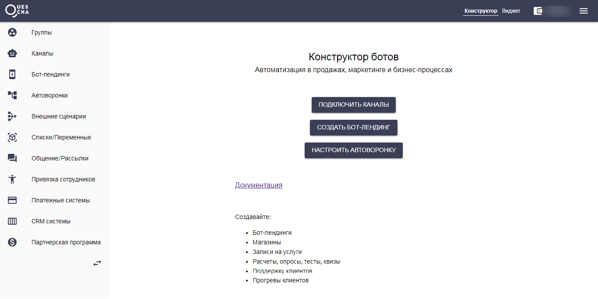

# Старт

[**Конструктор Квесча**](https://quescha.com) является облачной платформой создания чат-ботов.

Клиенты / Подписчики / Посетители получают запрограммированные сообщения через мессенджеры, бот-лендинги и виджет для сайта.&#x20;

Вся логика чат-ботов задается в автоворонках. Автоворонка состоит из цепочек сообщений. Каждая цепочка может быть запущена и остановлена путем добавления/удаления тегов (а также, при подписке, при начале диалога и по ключевым словам).

Цепочка состоит из сообщений, которые отправляются друг за другом с заданным интервалом времени.

Если в настройках сообщения сделать его "сценарием", то следующее сообщение в цепочке не придет до тех пор, пока определенное событие не завершит запущенный сценарий. Завершить сценарий можно запуском другой цепочки сообщений, либо явно указать это в настройках сценария.

Все ответы подписчика в сценарии можно получить, используя шаблоны \[Answer..] и \[AnswerID(..)] (Подробнее о [шаблонах](osnovnye-shablony-i-osobennosti.md))

<figure><figcaption></figcaption></figure>

В сценарии можно использовать сценарий действий, в котором настроена дополнительная логика, например, работа с данными, платежами, ссылками, CRM, Google Таблицами и т.д.

Сценарий действий может вызываться как сценарными блоками, так и через вебхуки или переходы по запрограммированным ссылкам.
