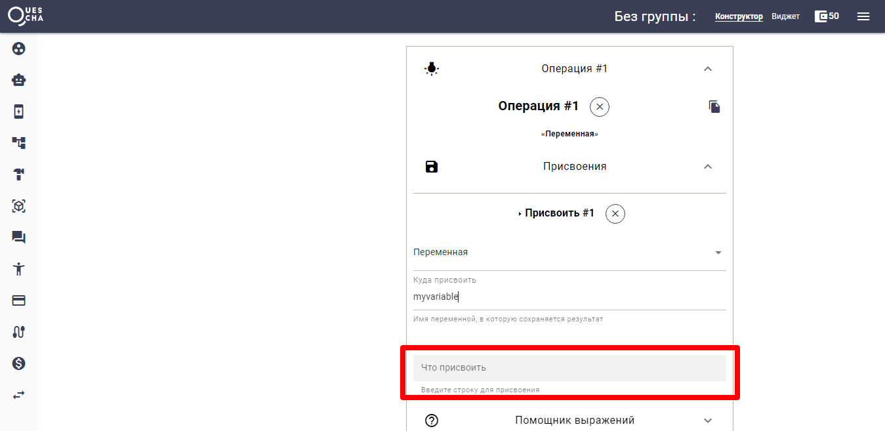

# Основные шаблоны и особенности

Функциональность Квесчи расширяется шаблонами замен, которые заменяются определенными данными. Шаблоны можно использовать в любых местах в сообщениях, условиях и присваиваемых переменных. Перечислим их и некоторые особенности конструктора.


Используйте раскрывающийся блок "Помощник выражений" и кнопку "Подстановки" для подстановки шаблонов и функций. Там вы найдете много полезного, включая описание их работы. Полный список смотрите [здесь](shablony-i-funkcii.md).


#### Переменные #{..}

Переменные используются в сценариях действий и имеют вид **#{name}**, где name - имя переменной. В переменных хранятся значения типа строка или массива строк. В переменную можно сохранять простые математические выражения с использованием других переменных и шаблонов.

Переменная является "видимой" во всех сценариях действий, которые вызываются одним и тем же сценарием и "живет" пока сценарий не будет завершен или перезапущен по /start.

Массив значений сохраняется в переменную путем сохранения отбора списка/гугл таблиц. Учитывайте то, что если у пользователя есть возможность повторно вызвать эту операцию (например, пользователь неправильно ввел данные и опять был вызван этот же шаг), то новый отбор не заменит данные в переменной, а дополнит ее. Поэтому, в некоторых случаях, имеет смысл обнулять переменную перед действием отбора списка и сохранения отбора в переменную.


Обнулить переменную можно отметив галочку при сохранении отбора в переменные, либо не указав ее значение (см. скриншот)


<figure><figcaption></figcaption></figure>

В значениях переменной вы можете хранить другие шаблоны.

Переменные могут быть использованы практически во всех полях для значений, если этого требует бизнес-логика.


Если переменная уже создана, ее можно выводить в сообщениях без использования сценария действий


#### Ответ \[Answer] или \[A] или \[Ответ]

Шаблон заменяется на последний ответ, который пришел от клиента.

#### Ответы \[Answer..] или \[A..] или \[Ответ..]

В ответах хранится то, что клиент написал в чат-бот, а также если он нажал кнопку типа "значение". Значение, которое вы указали в кнопке попадет в ответ.

Шаблон ответов используется как в сценарном сообщении, так и в сценарии действий и имеет вид **\[AnswerN]**, где N - порядковый номер сообщения сценария.

#### Данные \[Data..] или \[D..] или \[Данные..]

"Данные" хранят переданные данные из других сценариев по кнопке или переданные при запуске тегов, а также подгруженные при обращении к внешнему серверу.

Шаблон данных **\[DataID]**, где ID - id данных (число или строка)

#### Выражения \{{ .. \}}

Математическое выражение будет вычислено и заменено на результат.

#### Сравнение дат

В условиях сценарных сообщений и в условиях сценариев действий вы можете сравнить даты, используя математические символы =<>


С более полным списком шаблонов и функций вы можете ознакомиться по [ссылке](shablony-i-funkcii.md)


